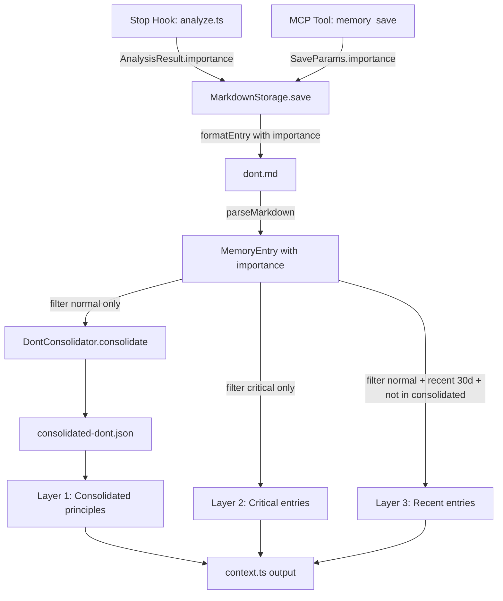

# Design: 記憶の強弱システム（importance field）

## Overview

dontメモリにimportance（`"critical"` | `"normal"`）フィールドを追加し、criticalエントリを統合（consolidation）から保護する。コンテキスト注入を3層構造に変更し、統合原則・永続的禁止・直近の鮮度をバランスよく提供する。

既存のMarkdown永続化・パース・統合のパイプラインに沿って拡張する。新規モジュールは作成せず、既存ファイルへのフィールド追加と分岐追加で実現する。

## Code Reuse Analysis

### Existing Components to Leverage
- **`storage/formatter.ts`**: `formatEntry()` にimportance行を追加する形で拡張
- **`storage/parser.ts`**: `parseMarkdown()` のメタデータパース部に `- **importance**:` 行を追加
- **`consolidator/dont-consolidator.ts`**: `consolidate()` 呼び出し前のフィルタリングで対応
- **`consolidator/formatter.ts`**: `formatConsolidatedDont()` は変更不要（統合原則のフォーマットは同一）
- **`cli/context.ts`**: `getDontContent()` を3層構造に拡張

### Integration Points
- **`prompts/analysis.txt`**: LLMへの分析指示にimportance判定基準を追加
- **`prompts/consolidate.txt`**: 変更不要（criticalはconsolidatorに渡される前にフィルタ済み）
- **`types.ts`**: 型定義の拡張（全コンポーネントの基盤）

## Architecture

importance機能の責務は以下の3フェーズに分離される：

```
[Phase 1: 判定]
  analysis.txt → Analyzer → AnalysisResult.importance
  memory_save → SaveParams.importance（手動指定）

[Phase 2: 永続化]
  SaveParams → MarkdownStorage.save() → formatter.formatEntry() → Markdown file
  Markdown file → parser.parseMarkdown() → MemoryEntry.importance

[Phase 3: 活用]
  consolidate-worker → filter(normal only) → DontConsolidator.consolidate()
  context.ts → 3層注入（consolidated + critical + recent 30d）
```



## Components and Interfaces

### Component 1: 型定義拡張 (`src/types.ts`)

- **Purpose:** importanceフィールドの型安全性を全コンポーネントに提供
- **Changes:**
  - `MemoryEntry` に `importance?: "critical" | "normal"` 追加
  - `MemoryIndexEntry` に `importance?: "critical" | "normal"` 追加
  - `SaveParams` に `importance?: "critical" | "normal"` 追加
  - `AnalysisResult` に `importance?: "critical" | "normal"` 追加
- **Optional型の理由:** 既存エントリにはimportanceフィールドが存在しない。undefinedは `"normal"` として扱う

### Component 2: Markdown永続化（`src/storage/formatter.ts` + `src/storage/parser.ts`）

- **Purpose:** importanceフィールドのMarkdownへの読み書き
- **formatter.ts Changes:**
  - `formatEntry()` で `entry.importance === "critical"` の場合のみ `- **importance**: critical` 行を出力
  - `"normal"` は省略（デフォルト値。既存エントリとの互換性維持 + ファイルサイズ削減）
- **parser.ts Changes:**
  - `parseMarkdown()` のメタデータパース部に `- **importance**:` 行の検出を追加
  - 検出時: `importance` フィールドに値をセット
  - 未検出時: `importance` は undefined（呼び出し側で `"normal"` として扱う）

### Component 3: 分析プロンプト（`prompts/analysis.txt`）

- **Purpose:** LLMにimportance判定基準を提供
- **Changes:**
  - 出力JSONスキーマに `"importance": "critical" | "normal"` を追加
  - critical判定基準を追加：
    1. 「絶対〜するな」「二度と〜するな」等の強い禁止表現
    2. ユーザーの感情強度が非常に高い（怒り・失望のピーク）
    3. 具体的かつ反復的に同一の問題を指摘している
  - dont以外のカテゴリは常に `"normal"` と明示

### Component 4: 統合フィルタ（`src/cli/consolidate-worker.ts`）

- **Purpose:** criticalエントリを統合対象から除外
- **Changes:**
  - `consolidate-worker.ts` でdontエントリ取得後、`importance !== "critical"`（undefinedも含む）でフィルタしてから `DontConsolidator.consolidate()` に渡す
  - `DontConsolidator` 自体は変更不要（入力が変わるだけ）

### Component 5: 3層コンテキスト注入（`src/cli/context.ts`）

- **Purpose:** SessionStart時に統合原則・critical・直近30日の3層でdontを注入
- **Changes:**
  - `getDontContent()` を拡張し、3層構造の文字列を構築する
  - 層1: 既存の `formatConsolidatedDont()` 出力（変更なし）
  - 層2: `storage.readDontEntries()` から `importance === "critical"` をフィルタし、タイトル+内容をそのまま出力
  - 層3: `storage.readDontEntries()` から `importance !== "critical"` かつ `timestamp` が直近30日以内かつ `consolidated-dont.json` の `sourceIds` に含まれないエントリを出力
- **Dependencies:** `MarkdownStorage.readDontEntries()`, `readConsolidatedDont()`

### Component 6: memory_saveツール拡張（`src/tools/save.ts`）

- **Purpose:** 手動保存時のimportance指定
- **Changes:**
  - `memorySaveTool` の `inputSchema.properties` に `importance` パラメータ追加
  - `handleMemorySave()` で `args.importance` を `SaveParams.importance` に渡す
- **Dependencies:** `MarkdownStorage.save()`

### Component 7: MarkdownStorage.save拡張（`src/storage/markdown.ts`）

- **Purpose:** SaveParams.importanceをMemoryEntryに反映
- **Changes:**
  - `save()` メソッドでMemoryEntry構築時に `params.importance` を設定
- **Dependencies:** なし（既存の `formatEntry()` がimportanceを出力する）

### Component 8: 検索結果のimportance反映（`src/storage/markdown.ts`）

- **Purpose:** 検索結果にimportanceを含めてAIが判断材料にできるようにする
- **Changes:**
  - `search()` メソッドの `MemoryIndexEntry` マッピングに `importance` 追加
- **Dependencies:** なし

## Data Models

### MemoryEntry（変更後）
```typescript
interface MemoryEntry {
  id: string;
  timestamp: string;
  category: MemoryCategory;
  content: string;
  title: string;
  tags: string[];
  project?: string;
  scope?: string;
  importance?: "critical" | "normal"; // NEW
}
```

### Markdown形式（criticalエントリの例）
```markdown
## エミュレータ再起動の禁止

- **id**: m1abc-1234
- **timestamp**: 2026-03-10T15:30:00.000+09:00
- **category**: dont
- **project**: my-project
- **importance**: critical
- **tags**: エミュレータ, 禁止
- **content**: ❌ エミュレータを勝手に再起動した...

---
```

### 3層コンテキスト出力形式
```
## やってはいけないこと（dont）

### 行動原則（統合済み）
[既存のformatConsolidatedDont出力]

### 絶対に守るべきルール（critical）
#### エミュレータ再起動の禁止
❌ エミュレータを勝手に再起動した...

### 直近の教訓（30日以内）
#### ログ確認漏れ
❌ ログを確認せずに回答した...
```

## Error Handling

### Error Scenarios
1. **importance値が不正（"critical"/"normal"以外）**
   - **Handling:** `"normal"` にフォールバック。バリデーションは不要（LLM出力が不正でも安全にデフォルト化）
   - **User Impact:** なし（内部で静かに正規化）

2. **既存エントリにimportanceフィールドなし**
   - **Handling:** parserがundefinedを返し、利用側で `"normal"` として扱う
   - **User Impact:** なし（後方互換性が保たれる）

3. **全dontエントリがcritical（統合対象が0件）**
   - **Handling:** consolidate-workerでフィルタ後のエントリが0件なら統合をスキップ。既存のconsolidated-dont.jsonを保持
   - **User Impact:** 層1が前回の統合結果のまま表示される

## Testing Strategy

### Unit Testing
- **parser.ts**: importanceフィールド有無のパーステスト（`markdown.test.ts` に追加）
- **formatter.ts**: importance: "critical" 時のみ出力、"normal"/undefinedは出力なしのテスト（`formatter.test.ts` に追加）
- **consolidate-worker.ts**: criticalフィルタリングのテスト
- **context.ts**: 3層出力構造のテスト

### Integration Testing
- **End-to-End保存→読み込み**: importance: "critical" で保存 → パースして importance が保持されることを確認
- **統合フロー**: critical+normalエントリ混在 → 統合後にcriticalが除外されていることを確認
- **コンテキスト注入**: 3層が正しい順序・内容で出力されることを確認
