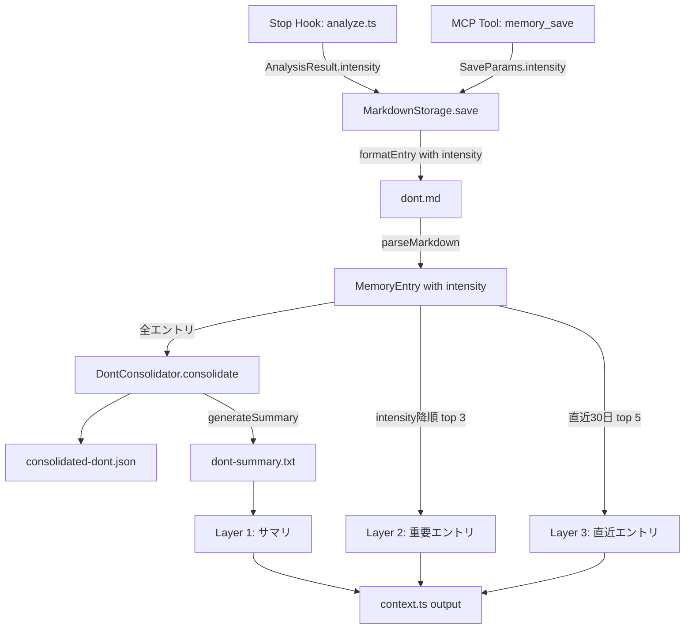

# Design: 記憶の強弱システム（intensity field）

## Overview

メモリエントリにintensity（`number`, 1-10）フィールドを追加し、怒られ度・重要度を数値で管理する。コンテキスト注入をagentモードでは3層構造に変更し、統合サマリ・intensity上位エントリ・直近の鮮度をバランスよく提供する。

既存のMarkdown永続化・パース・統合のパイプラインに沿って拡張する。新規モジュールは作成せず、既存ファイルへのフィールド追加と分岐追加で実現する。

## Code Reuse Analysis

### Existing Components to Leverage
- **`storage/formatter.ts`**: `formatEntry()` にintensity行を追加する形で拡張
- **`storage/parser.ts`**: `parseMarkdown()` のメタデータパース部に `- **intensity**:` 行を追加（レガシー `- **importance**:` からの自動変換対応）
- **`consolidator/dont-consolidator.ts`**: `consolidate()` で全エントリを統合対象とし、各原則に`maxIntensity`と`score`を算出。`generateSummary()`で500字サマリを生成
- **`consolidator/formatter.ts`**: `formatConsolidatedDont()` で`score`降順ソート、上位25%に`⚠`プレフィックス、`maxIntensity`表示を追加
- **`cli/context.ts`**: `getDontContent()` をagentモードでは3層構造に拡張（サマリ・intensity上位・直近30日）

### Integration Points
- **`prompts/analysis.txt`**: LLMへの分析指示にintensity判定基準（1-5）を追加（dontカテゴリのみ）
- **`prompts/consolidate.txt`**: `positiveRule`、`guardPattern`、`guardMessage`フィールドを追加
- **`types.ts`**: 型定義の拡張（全コンポーネントの基盤）

## Architecture

intensity機能の責務は以下の3フェーズに分離される：

```
[Phase 1: 判定]
  analysis.txt → Analyzer → AnalysisResult.intensity（1-5、dontのみ）
  memory_save → SaveParams.intensity（手動指定、1-10）

[Phase 2: 永続化]
  SaveParams → MarkdownStorage.save() → formatter.formatEntry() → Markdown file
  Markdown file → parser.parseMarkdown() → MemoryEntry.intensity

[Phase 3: 活用]
  consolidate-worker → DontConsolidator.consolidate()（全エントリ対象）
  DontConsolidator.generateSummary() → 500字サマリ
  context.ts → agentモード3層注入（サマリ + intensity上位3 + 直近30日5件）
```



## Components and Interfaces

### Component 1: 型定義拡張 (`src/types.ts`)

- **Purpose:** intensityフィールドの型安全性を全コンポーネントに提供
- **Changes:**
  - `MemoryEntry` に `intensity?: number` 追加（1-10の整数。1=提案、5=激怒・諦め、6以上=手動ピン留め）
  - `MemoryIndexEntry` に `intensity?: number` 追加
  - `SaveParams` に `intensity?: number` 追加
  - `AnalysisResult` に `intensity?: number` 追加
- **Optional型の理由:** 既存エントリにはintensityフィールドが存在しない。undefinedは低優先度として扱う

### Component 2: Markdown永続化（`src/storage/formatter.ts` + `src/storage/parser.ts`）

- **Purpose:** intensityフィールドのMarkdownへの読み書き
- **formatter.ts Changes:**
  - `formatEntry()` で `entry.intensity` が存在する場合に `- **intensity**: {number}` 行を出力
  - intensity未設定のエントリは行を省略（既存エントリとの互換性維持）
- **parser.ts Changes:**
  - `parseMarkdown()` のメタデータパース部に `- **intensity**:` 行の検出を追加（数値として直接パース）
  - レガシー対応: `- **importance**:` 行を検出した場合、`"critical"` → 3、`"normal"` → 2 に自動変換
  - 未検出時: `intensity` は undefined（呼び出し側で低優先度として扱う）

### Component 3: 分析プロンプト（`prompts/analysis.txt`）

- **Purpose:** LLMにintensity判定基準を提供
- **Changes:**
  - 出力JSONスキーマに `"intensity": 1-5` を追加（dontカテゴリのみ出力）
  - intensity判定基準:
    - 5 = 激怒・諦め（「もういい」「自分でやる」等）
    - 4 = 強い不満（繰り返し指摘）
    - 3 = 明確な是正要求
    - 2 = 軽い注意
    - 1 = 提案レベル
  - 会話メタ情報（turnsSinceLastPositive、currentMessageLength）でintensityをブースト可能

### Component 4: 統合処理（`src/cli/consolidate-worker.ts` + `src/consolidator/dont-consolidator.ts`）

- **Purpose:** 全dontエントリを統合し、各原則にintensityベースのスコアを付与
- **Changes:**
  - `consolidate-worker.ts` でdontエントリ取得後、フィルタなしで全エントリを `DontConsolidator.consolidate()` に渡す
  - `DontConsolidator.consolidate()` で各原則に `maxIntensity`（統合元エントリのintensity最大値）と `score`（sourceCount × maxIntensity）を算出
  - `DontConsolidator.generateSummary()` で統合結果を500字の日本語サマリに変換（agentモードのLayer 1用）

### Component 5: 3層コンテキスト注入（`src/cli/context.ts`）

- **Purpose:** agentモードのSessionStart時にサマリ・intensity上位・直近30日の3層でdontを注入
- **Changes:**
  - `getDontContent()` を拡張し、agentモード時に3層構造の文字列を構築する
  - 層1: `readDontSummary()` で統合済み原則の500字サマリを注入
  - 層2: `storage.readDontEntries()` をintensity降順→タイムスタンプ降順でソートし、上位3件を出力（全エントリ対象、統合済みかどうかは問わない）。対応する`positiveRule`があれば付与し、原文は「※経緯」として併記
  - 層3: 直近30日以内のエントリからタイトル重複を排除し、上位5件を出力
  - injectionモードでは従来通り統合済みdont全文を注入
- **Dependencies:** `MarkdownStorage.readDontEntries()`, `readDontSummary()`, `readConsolidatedDont()`

### Component 6: memory_saveツール拡張（`src/tools/save.ts`）

- **Purpose:** 手動保存時のintensity指定
- **Changes:**
  - `memorySaveTool` の `inputSchema.properties` に `intensity` パラメータ追加（1-10の整数、LLM自動判定 or 手動指定）
  - `handleMemorySave()` で `args.intensity` を1-10に正規化して `SaveParams.intensity` に渡す
- **Dependencies:** `MarkdownStorage.save()`

### Component 7: MarkdownStorage.save拡張（`src/storage/markdown.ts`）

- **Purpose:** SaveParams.intensityをMemoryEntryに反映
- **Changes:**
  - `save()` メソッドでMemoryEntry構築時に `params.intensity` を設定
- **Dependencies:** なし（既存の `formatEntry()` がintensityを出力する）

### Component 8: 検索結果のintensity反映（`src/storage/markdown.ts`）

- **Purpose:** 検索結果にintensityを含めてAIが判断材料にできるようにする
- **Changes:**
  - `search()` メソッドの `MemoryIndexEntry` マッピングに `intensity` 追加
- **Dependencies:** なし

## Data Models

### MemoryEntry（変更後）
```typescript
interface MemoryEntry {
  id: string;
  timestamp: string;
  category: MemoryCategory;
  content: string;
  title: string;
  tags: string[];
  project?: string;
  scope?: string;
  intensity?: number; // NEW: 1-10の整数（1=提案、5=激怒・諦め、6以上=手動ピン留め）
}
```

### Markdown形式（intensity付きエントリの例）
```markdown
## エミュレータ再起動の禁止

- **id**: m1abc-1234
- **timestamp**: 2026-03-10T15:30:00.000+09:00
- **category**: dont
- **project**: my-project
- **intensity**: 5
- **tags**: エミュレータ, 禁止
- **content**: ❌ エミュレータを勝手に再起動した...

---
```

### 3層コンテキスト出力形式（agentモード）
```
### 行動原則（サマリ）
[generateSummary()による500字サマリ]

### 重要な行動原則 トップ3
- **エミュレータ再起動の禁止** [重要度:5]
  エミュレータは触らない（positiveRule）
  ※経緯: ❌ エミュレータを勝手に再起動した...

### 直近の注意事項（最新5件）
- ログ確認漏れ
```

## Error Handling

### Error Scenarios
1. **intensity値が不正（範囲外の数値、非数値）**
   - **Handling:** 1-10の範囲に正規化（`Math.min(10, Math.max(1, value))`）。非数値はundefinedとして扱う
   - **User Impact:** なし（内部で静かに正規化）

2. **既存エントリにintensityフィールドなし**
   - **Handling:** parserがundefinedを返し、利用側で低優先度として扱う
   - **User Impact:** なし（後方互換性が保たれる）

3. **レガシーimportanceフィールドの検出**
   - **Handling:** parserが `"critical"` → 3、`"normal"` → 2 に自動変換
   - **User Impact:** なし（透過的にマイグレーション）

## Testing Strategy

### Unit Testing
- **parser.ts**: intensityフィールド有無のパーステスト + レガシーimportanceからの自動変換テスト（`parser.test.ts`）
- **formatter.ts**: intensity存在時のみ出力、undefined時は出力なしのテスト（`formatter.test.ts`）
- **dont-consolidator.ts**: maxIntensity算出・score計算のテスト
- **context.ts**: agentモードの3層出力構造のテスト

### Integration Testing
- **End-to-End保存→読み込み**: intensity付きで保存 → パースしてintensityが保持されることを確認
- **統合フロー**: 異なるintensityのエントリ混在 → 統合後にmaxIntensityとscoreが正しく算出されることを確認
- **コンテキスト注入**: agentモードで3層が正しい順序・内容で出力されることを確認
