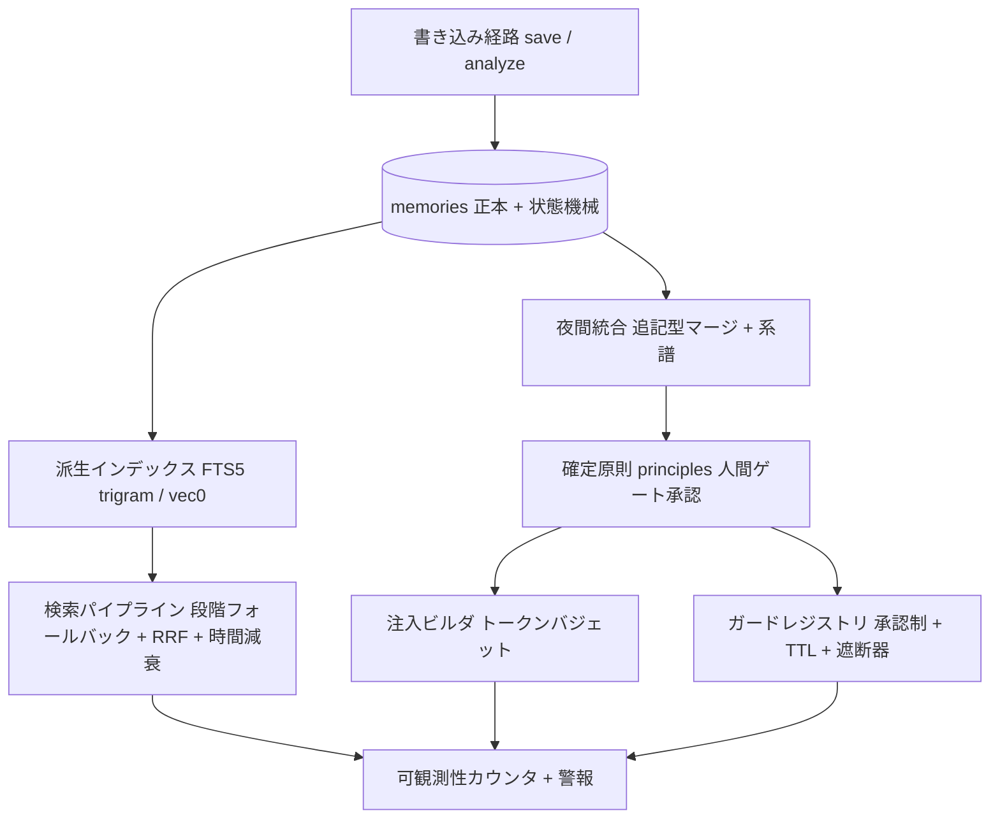

# Design Document

## Overview

本設計は memory-redesign（requirements.md）を「止血→土台→検索→代謝→注入とガード」の5フェーズで実装する。
Phase 0（止血）、Phase 1（土台）、Phase 2（検索再建）、Phase 3（代謝＝統合と昇格）、Phase 4（注入とガード再設計）の順である。

一番目立つ検索から着手する案は不採用とした。
汚染が進行中のデータの上に検索を作ると、後の再埋め込みと帰属修正で評価が全部無効になるためである。

Specの分割は3系統（A：正本ストアと生死管理、B：派生インデックスと検索、C：注入とガード）と計測系統Mに対応させるが、配置は本フィーチャーディレクトリ1つに集約し、フェーズゲート方式で進める。
フェーズ順序と依存は tasks.md が持ち、各フェーズの完了はゲートスクリプトの実行出力（結果本文）の貼付で判定する。
exit code では判定しない。

各フェーズは必ず次の4点を持つ。

1. スキーマ移行手順
2. non-goals（触ってはいけないファイル、やってはいけないリファクタ）
3. 実行可能な検証ゲート（スクリプトの契約：入力、前提アサート、出力形式）
4. ロールバック手順

## Steering Document Alignment

### Technical Standards (tech.md)

本フィーチャーのSteering文書は同ディレクトリの product.md、tech.md、structure.md である。
本設計はその技術判断（スタック継続、ピン留めとスパイクの規律、fail-loud、LLM呼び出しの抽象経由）に従う。

TypeScript 5.x、Node.js 18以上、ESM、better-sqlite3、sqlite-vec、@huggingface/transformers、genkit、vitest という現行スタックを継続する。
テストランナーの移行（vitest から他への変更）は行わない。

ライブラリとバージョンのピン留め方針は次の通り。

| ライブラリ | 方針 |
|---|---|
| better-sqlite3 | 現行 ^12.8.0 を維持。昇版は本Specと無関係の単独コミットでのみ行う |
| sqlite-vec | 0.1.9 へexact pin（`^` を外す）。API仕様はスパイク（タスク0.1）で実在確認してから使う |
| @huggingface/transformers | 現行 ^4.0.1 を維持。差替え候補モデルの実在はスパイク（タスク1.1）で確認する |
| vitest | 現行 ^4.0.18 を維持 |
| fast-check | 新規devDependency。導入時に最新安定版を確認しexact pinで固定する |
| トークン計数ライブラリ | 候補選定と実在確認をスパイク（タスク0.3）で行い、確定後にexact pinで固定する。未確定のまま実装に入らない |

SQLiteベクトル拡張とFTS5トークナイザとトークン計数器は、LLM実装者がAPIを幻覚しやすい領域である。
このためスパイク（実在確認）を Phase 0 系タスクの先頭に置き、スパイクで動作確認した構文以外を実装で使うことを禁止する。

### Project Structure (structure.md)

新規モジュールは既存の層構成（src/storage、src/vector、src/tools、src/cli、src/consolidator）に従って配置する。
新設ディレクトリは src/search（検索パイプライン）、src/injection（注入ビルダ）、src/guards（ガードレジストリ）、src/observability（カウンタ）、scripts/gates（フェーズゲート）、scripts/spikes（実在確認スパイク）に限る。
ファイル命名は kebab-case、TypeScript内の識別子は camelCase、DB列名は既存慣習（snake_case）を維持する。

## Code Reuse Analysis

### Existing Components to Leverage

- **src/vector/cosine-distance.ts**: 距離変換の既存実装。距離尺度の型封じ（後述）の土台として拡張する
- **src/storage/migration.ts の migrateVXToVY 関数群と src/storage/sqlite.ts:44-72 の移行ディスパッチ**: 版数は schema_version テーブルで管理する（テーブル定義 schema.ts:108、版数の記録 schema.ts:124-129、参照は `SELECT MAX(version)` schema.ts:134）。v5からv8への移行はこの既存機構へ追記する。新規の移行フレームワークは作らない。PRAGMA user_version は使われていない
- **操作ログJSONL（logs/operation-*.jsonl）**: 可観測性カウンタの出力先と、ゴールデンセットの採取元として流用する
- **prompts/consolidate-cluster.txt（36行）と prompts/consolidate-config.txt（38行）**: 統合プロンプトとして維持する。いずれも100行以下の原則に適合済み
- **dream系のredact処理（src/cli/dream-worker.ts:74-80）**: 実データスナップショット作成時の秘密値マスクに転用する
- **src/vector/search-scorer.ts の利用実績加点**: 破壊的自動昇格（監査D13）の廃止後、利用実績シグナルの反映先はこの既存加点に一本化する。ただし freshness 項（search-scorer.ts:16-31、半減期14日）は Phase 2 で除去し、recency の反映は新設 time-decay に一本化する（二重減衰の禁止）
- **vitest基盤と既存テスト群**: 全フェーズのTDDで継続利用する

### Integration Points

- **SessionStart / PreCompact / Stop フック**: 既存のフック配線は維持し、呼び先CLIの中身を差し替える
- **launchd夜間ジョブ**: consolidate-all を唯一の統合系として維持し、v1経路を遮断する
- **memory.db（SQLite）**: 既存スキーマ（v5。コミット済みHEADの CURRENT_SCHEMA_VERSION=5 が版数ベースライン。2026-07-03の予測誤差ループ保全コミット8b915a5がv5を占有したため、本Spec起草時点の想定であったv4から1段繰り上がっている）から段階移行する。ストアの置き場所と接続方式は変えない

外部の共有基盤ライブラリについて：本リポジトリは公開のスタンドアロンnpmパッケージであり、開発チームが他プロジェクトで使う共有基盤への依存が存在しないことを確認した。
流用するのはSpecテンプレートとチーム規約（TDD、タスク粒度）のみである。

## Architecture

書き込みは正本（memories）に集約し、検索と注入は派生物（FTS、ベクトル、統合キャッシュ、確定原則）を読む。
派生物はすべて正本から再構築可能とする（バックアップ要件 R-A1 と状態機械がこれを支える）。



### Modular Design Principles

- **Single File Responsibility**: クエリ構築、順位統合、減衰、バジェット計数は各1ファイルに分離する
- **Component Isolation**: CLI（フック経由）とMCPツールは同一の実装モジュールを呼ぶ。経路ごとの再実装を禁止する
- **Service Layer Separation**: ストレージ層（SQL）、パイプライン層（検索と注入の組み立て）、エントリポイント層（MCPツールとCLI）を分離する
- **Utility Modularity**: 距離尺度、トークン計数、系譜操作は単目的ユーティリティにする

## 記憶の状態機械（系統Aの中核）

**状態**：active（現役）、archived（退役、明示アクセスのみ可）、deleted（論理削除、終端）。

**遷移**：

| 遷移 | 契機 | 可逆性 |
|---|---|---|
| active → archived | 退役（キュレーション、上限ローテーション） | 可逆（restore） |
| archived → active | 復元、サルベージ採用 | 系譜記録を伴う |
| active → deleted | 削除、統合による吸収 | 不可逆（物理削除以外の後続なし） |
| archived → deleted | 整理 | 不可逆 |

deleted から active への遷移（蘇生）は定義しない。
蘇生に相当する操作が必要な場合は、新IDでの再保存として扱い、旧IDとの関係を系譜に残す。

**読み経路の可視性マトリクス**：

| 読み経路 | active | archived | deleted |
|---|---|---|---|
| 検索（FTS、ベクトル、新着） | 可 | 不可 | 不可 |
| 注入（SessionStart、PreCompact） | 可（承認済み原則と索引のみ） | 不可 | 不可 |
| backfill（埋め込み生成） | 可 | 不可 | 不可 |
| 統合（夜間） | 可 | 不可 | 不可 |
| get_detail（ID直接指定） | 可 | 可 | 不可 |
| バックアップとエクスポート | 可 | 可 | 可 |

**不変条件**（プロパティテスト PT-01、PT-05 の対象）：

- I1：deleted はいかなる読み経路からも返らない
- I2：ベクトル行とFTS行は state='active' の memories 行と1:1対応する（archived と deleted の索引行は存在しない）
- I3：読み経路は状態もタイムスタンプも変更しない（読み取りの無副作用）
- I4：state='deleted' と deleted_at IS NOT NULL は常に同値（互換列との同期）

## 距離尺度の型設計（系統Bの中核）

L2距離とコサイン類似度の取り違え（閾値0.6の誤適用、監査D2）を、規約ではなく型エラーで再発防止する。

```typescript
// src/vector/distance-types.ts（新設。cosine-distance.ts を土台に拡張）
export type L2Distance = { readonly measure: "l2"; readonly value: number };
export type CosineSimilarity = { readonly measure: "cosineSim"; readonly value: number };
export type Threshold<M extends string> = { readonly measure: M; readonly value: number };

// 正規化済みベクトル前提の変換。前提は埋め込みサービス側でアサートする
export function l2ToCosineSim(d: L2Distance): CosineSimilarity;

// 同一尺度同士しかコンパイルが通らない比較
export function isWithin<M extends string>(
  v: { readonly measure: M; readonly value: number },
  t: Threshold<M>
): boolean;
```

閾値は必ず `Threshold<M>` で保持し、生の number を閾値として持ち回ることを禁止する。
既存の生数値閾値（src/cli/consolidate-all.ts:78 の0.25。旧値0.6は埋め込みモデル差替えに伴う距離分布収縮を受けてa9cb7abで0.25へ再較正済みだが、これは応急の目安値でありラベル付きペアでの実測較正と型封じ自体は未実施、src/vector/memory-tier.ts:9-13 のv1時代の値）はすべてこの型へ置換し、値そのものはラベル付きペア（後述）でさらに較正し直す。
前提として、埋め込みはすべて保存時にL2正規化する（正規化されていないベクトルの保存は埋め込みサービスがエラーで拒否する）。

## 昇格の人間ゲート（系統A）

確定原則（常時注入される行動原則）の昇格フローを次で固定する。

1. 夜間統合が原則候補を principles テーブルへ state='proposed' で起草する（LLMは文面の起草のみ）
2. オーナーがCLI（`wasurenagusa-promote list / approve <id> / reject <id>`）で承認または却下する。承認で approved_at が刻印され state='approved' になる
3. 注入ビルダは state='approved' かつ valid_until が未来の原則だけを注入対象にする
4. valid_until 到来で注入から外れる。再検証（再承認）で期限を更新する

失効の実装方式：不変条件「失効した原則は注入されない」は、検索と注入のクエリ時判定（valid_until と現在時刻の比較）で担保する（プロパティテスト対象。G3 の human-gate と G4 の injection-composition で検査）。
夜間バッチによる state='expired' への書き換えは可観測性のためのラベル更新であり任意（不変条件はバッチの実行に依存しない）。

origin_tier（owner_confirmed / agent_observed）、evidence_ids（元記憶ID群）、valid_until は NOT NULL とし、欠けた候補は起草段階で拒否する。
自動昇格の経路（アクセス数による intensity 書き換え等）は Phase 2 で廃止し、以後追加しない。

## ガード設計（系統C）

ガードは「事故の再発をツール入力の照合で止める」層である。
自動生成は全廃し、次の構造にする。

- **承認制**：guards テーブルの規則のみ評価する。source_incident_id（事故ID）と expires_at（TTL）は NOT NULL。承認操作は `wasurenagusa-guard approve <id>` のCLIでオーナーが行う
- **失効**：expires_at 到来で自動失効（state='expired'）。再確認で延長する
- **規則数上限**：アクティブ規則は既定20件以下（設定可）。上限超過の有効化はエラー（PT-03）
- **サーキットブレーカ**：直近100回のPreToolUse評価でブロック率が10%を超えたら、全ガードを自動停止して警報する（自己DoS対策）
- **外部キルスイッチ**：ストア直下に `guards.kill` ファイルが存在したら全ガードを即時停止する。MCPやフックのプロセスを経由せず、シェルから `touch` するだけで効く。ガードを直すツールまでブロックするロックアウトが最悪形であるため、外部から効く停止手段を初期仕様に含める
- **既存64パターンの扱い**：全廃前に出所を採掘し、実事故由来と確認できたものだけを guards テーブルへ承認申請する。確認できないパターンは移行しない
- **段階的ロールアウト**：本番投入は次の順序で固定し、逆順や飛び越しをしない。①外部キルスイッチの実装 ②サーキットブレーカの実装 ③dry-run観測モード（承認済み規則の照合は行うがブロックはせず、判定結果をログにのみ残す）での実運用観測 ④観測レポートの作成 ⑤オーナー承認 ⑥利用者側 `settings.json` へのフック配線。ブロック権限を持たせる前に、安全装置（キルスイッチ、サーキットブレーカ）と観測実績を先に揃える

## LLM呼び出し設計（llm-design 4原則への準拠）

LLMに残すのは文脈と意味と曖昧性を伴う判断のみとし、それ以外はすべてコード側に置く。

| 呼び出し | LLMの責務（意味判断のみ） | コード側の責務 | プロンプト上限 | 出力検証ガード |
|---|---|---|---|---|
| 統合マージ（夜間） | 同一教訓か否かの意味判断と、マージ文面の生成 | 近傍探索、閾値判定、カテゴリ絞り込み、バッチ分割、上限件数、系譜記録 | 50行（現行36行を維持） | sourceIds が入力ID集合の部分集合か（差分判定）、category がenum内か、必須フィールド有無 |
| 確定原則の起草 | 原則文の起草 | 候補抽出、evidence収集、TTL付与、承認フロー | 50行 | evidence_ids が入力ID集合の部分集合か、必須フィールド有無 |
| サルベージ判定（キュレーション） | 「現在も有効な教訓か」の意味判断 | 重複検出（ハッシュ、編集距離）、件数集計、バッチ分割、取り込み実行 | 50行 | 判定値がenum内か、対象IDが入力集合の部分集合か |

検証ガードの共通設計：違反を検出したら warning ログと計数を残し、当該フィールドを破棄または当該バッチをスキップする。
throw にはしない。
LLM出力の業務整合性検査を throw で強制すると、LLMの責務（曖昧入力への意味判断）を構造的に阻害するためである。
一方、スキーマ形式（JSONとしてパースできるか、必須キーが揃っているか）の検査は決定論層の検査であり、失敗はバッチスキップと計数で扱う（無検証キャストの継続は禁止フォールバック#3）。

ガードパターンの生成にLLMを使うことは全面禁止する（R-C4、64正規表現事故の設計制約）。

## フェーズ設計

### Phase 0：止血（減算のみ、新規コード最小）

目的：出血源（v1書き込み、ガード自動生成、夜間統合の書き込み、全文注入）を止め、計測を最初に出荷し、全データを可逆にする。

内容：

1. 作業ツリーの清算（未コミットWIPの退避と除去、版数ベースライン=v5の確定。タスク0.0）。Phase 0 の他タスクは作業ツリーがクリーンになってから着手する
2. 全ストアの全量バックアップ（復元リハーサルは主ストアで実施、他ストアはチェックサム検証。これはデータ移行プロジェクトである）
3. v1 Markdown統合系の書き込み経路の物理遮断（凍結の約束ではなくコード上の遮断。アーカイブファイル自体は保持）
4. ガードパターン自動生成の停止（手動応急処置済み状態の恒久化）
5. 夜間統合のdry-run化（レポートのみ出力、書き込み停止）
6. 可観測性カウンタ5指標（ゼロヒット率、注入トークン数、統合件数、ブロック件数、蘇生件数）と閾値警報
7. SessionStart注入の修復（シンボリックリンク実パス解決）と注入バジェット強制の同一タスク同時着地

①スキーマ移行手順：スキーマ変更なし（schema_version テーブルの MAX(version)=5 のまま）。
これは制約であり、Phase 0 でスキーマに触れる変更は差し戻し対象である。

②non-goals：

- 触ってはいけないファイル：src/storage/schema.ts のテーブル定義、src/storage/sqlite.ts の検索クエリ本体、src/vector/ の埋め込み生成ロジック、prompts/ 全ファイル
- やってはいけないリファクタ：ファイル改名、v1ファイル（Markdown、vectors.json）の削除や移動、検索やランキングの「ついで改善」、統合アルゴリズムの調整

③検証ゲートG0（scripts/gates/g0-hemostasis.ts）：

- 入力：`--store <ストアパス>` `--backup <バックアップ先パス>`
- 前提アサート：DBがオープンできる、memories 総件数が1,000件以上（空DBでの空振り合格を防ぐ）、操作ログが存在する
- 検査項目：backup-restore（対象全ストアを走査し、各ストアのバックアップ存在とチェックサム検証。主ストアは復元リハーサルまで実施し件数とチェックサム一致）、v1-blocked（セッション開始処理を実行してもMarkdownと vectors.json の更新時刻が不変）、guard-gen-stopped（統合実行後にガードパターンの再生成が発生しない）、nightly-dryrun（夜間統合実行後に memories と統合キャッシュへの書き込みが0件で、レポートが生成される）、counters（5指標の出力が存在する）、injection（シンボリックリンク経由実行の出力が1KB以上かつトークンバジェット以下）
- 出力形式：1検査1行のJSON（check、result=PASS/FAIL、measured、threshold）に続けて人間可読サマリ。記憶本文とクエリ本文は出力しない

④ロールバック手順：Phase 0 はデータ無変更のため、コード変更コミットの `git revert` のみで戻る。
revert対象コミットの一覧を Implementation Log に記録する。
バックアップからの復元手順（コピー戻しとチェックサム照合）はこのフェーズで確立し、以降の全フェーズが再利用する。

### Phase 1：土台

目的：状態機械、帰属、埋め込みモデル、並列耐性というデータ土台を固める。
検索再設計（Phase 2）の要否と規模は、安価で情報量の多い実験（トークナイザスパイク）で先に確定する。

トークナイザスパイクの明確化：FTS索引は既にtrigramトークナイザである（src/storage/schema.ts:37）。
一方でクエリ側が全体をフレーズ固定で包む（src/storage/sqlite.ts:814-816 の escapeFtsQuery）ため、索引の性質を活かせていない。
スパイクは「クエリ側をtrigram整合（引用符除去とトークン分割）へ変えるだけ」の最小変更で、凍結スナップショット上のゼロヒット率を再計測し、ゼロヒットへの主因寄与を確定する。

内容：

1. トークナイザ先行スパイク（上記）
2. 埋め込みモデルの日本語実測評価と、多言語対応モデルへの差替え判断。モデル識別子列を追加し、全件再埋め込みの完了ゲートを通過するまで新旧ベクトルの混在利用を禁止する
3. 状態機械の実装（本書「記憶の状態機械」）と不変条件のプロパティテスト化
4. backfillの蘇生禁止フィルタと、残存する削除済みベクトル751件の一括掃除
5. project帰属の修正（保存時刻印）と決定論バックフィル（信頼度付与、完了までprojectフィルタ無効化）
6. 書き込み失敗計数の追加。WALとbusyタイムアウトはHEADで設定済み（src/storage/schema.ts:112-113）のため、確認とテスト固定のみ行う
7. 埋め込みモデルの共有キャッシュ化（7重複522MBの回収）と旧世代 vectors.json の廃棄（バックアップ後）

①スキーマ移行手順：版数 5→6。
migrateV5ToV6 として src/storage/migration.ts へ追加し、src/storage/sqlite.ts:44-72 の移行ディスパッチへ配線する。

1. 移行開始前に Phase 0 のバックアップスクリプトを自動実行する。失敗時は移行を中止する
2. memories へ `state` 列を追加する（TEXT NOT NULL DEFAULT 'active'、CHECK で active / archived / deleted に限定）
3. 既存行をバックフィルする（deleted_at IS NULL → active、それ以外 → deleted）
4. memories へ `project_confidence` 列を追加する（TEXT NOT NULL DEFAULT 'unknown'、CHECK で confirmed / inferred / unknown に限定）
5. vector_metadata へ `embedding_model` 列を追加し、既存行を現行モデル識別子でバックフィルする
6. `deleted_at` 列は互換のため保持し、書き込み経路で state と同期する（不変条件I4）

モデル差替え時のベクトル表：新モデル用のベクトル表を別名で新設し、コード側の参照定数で切り替える。
旧表は次フェーズのゲート通過まで並存保持する。

②non-goals：

- 触ってはいけない領域：検索の順位付けとRRF（Phase 2）、統合アルゴリズム（Phase 3）、注入整形とガード（Phase 4）、prompts/ 全ファイル
- やってはいけないリファクタ：テストランナーの変更、ファイル改名、アーカイブMarkdownの取り込み、スパイク結果を待たない検索本実装への着手

③検証ゲートG1（scripts/gates/g1-foundation.ts）：

- 入力：`--store <ストアパス>`
- 前提アサート：schema_version テーブルの MAX(version)=6、バックアップが存在する、memories 総件数が1,000件以上
- 検査項目：state-consistency（state と deleted_at の同期が全件一致）、pt-invariants（PT-01とPT-05のテスト実行が緑）、resurrection-zero（deleted 行に対応するベクトル行が0件）、embedding-single-model（生存エントリのベクトルの embedding_model が単一値。モデル据え置きと判断した場合はその判断記録の存在）、project-confidence（confirmed / inferred / unknown の件数分布の出力と、バックフィル完了状態とprojectフィルタ有効化状態の整合）、wal（journal_mode が wal かつ busy_timeout が設定済み）、write-failure-counting（書き込み失敗が計数される検査が緑。R-A5 AC3の明示検査）、shared-cache（モデル実体が共有キャッシュ1箇所）、spike-report（トークナイザ再計測のbefore/afterゼロヒット率の記録が存在する）
- 出力形式：G0と同形式

④ロールバック手順：DBはバックアップコピーの差し替えで復元する（SQLiteの列削除制約のため列単位では戻さない）。
新ベクトル表は参照定数を旧表へ戻すだけで切り戻せる。
コードは `git revert`。

### Phase 2：検索再建

目的：検索を「段階フォールバック＋RRF＋時間減衰」へ再建し、ゴールデンセットとシャドー並走で実測確認してから切り替える。

検索パイプラインの定義：

1. FTS段階フォールバック：フレーズ→AND→OR の順で試行し、最初にヒットした段の結果を採用する。各段の発火を計数する
2. ベクトル検索：候補プールk=20目安（最終値は実測で確定）
3. RRF統合：`score = Σ 1/(60 + rank_i)`（経路=FTS段とベクトル）。各経路の順位のみを使い、欠損経路のスコアを捏造しない
4. 時間減衰：`finalScore = rrfScore × 0.5^(ageDays / H)`。半減期Hは既定90日とし、ゴールデンセットで較正する。recency の反映元はこの time-decay ただ一つとし、既存の検索スコアラーの freshness 項（src/vector/search-scorer.ts:16-31、半減期14日）は除去する（二重減衰の禁止）。アクセス実績ブースト等の非recency素性は存置する
5. 新着フォールバック：全段0件のとき新着N件を「フォールバック明示ラベル付き」で返す

ヒント文言（0件時の案内、詳細取得への誘導）は `src/storage/search-hint.ts` の `buildSearchHint(count)` を唯一の判定源とし、呼び出し側は必ずマージ後の最終返却件数を渡して都度再導出する（他モジュールへのimportを持たない葉モジュール。626f8d1で実装済み）。project="active" の横断検索でマージ前に確定した文言をそのまま使い回す実装は、この一元化に反するため差し戻し対象とする。この一元化は「0件か否かで文言を出し分ける」既存の関心を解消済みであり、タスク2.10が扱うのはこれとは別の未着手事項（発火したフォールバック段そのもののラベルをヒントへ追加すること）に範囲が限定される。

読み経路の無副作用：検索中の破壊的自動昇格（src/tools/search.ts:125-152。intensity書き換えとタイムスタンプ更新）を廃止する。
読み取りがタイムスタンプを書き換えると時間減衰順位が汚染されるため、順位再設計の前提である。
利用実績の反映は既存の検索スコア加点に一本化する。

①スキーマ移行手順：原則なし（クエリ側変更のみ）。
スパイク結果がFTS表の再構築を要求した場合のみ、新FTS表を別名で作成→全件流し込み→トリガ切替→ゲート通過後に旧表を削除、の手順を踏む。

②non-goals：

- 触ってはいけない領域：保存経路、統合、注入、ガード、スキーマ、埋め込みモデル（Phase 1 で確定済みのものを使う）
- やってはいけないリファクタ：横断検索（project="active"）の順位統一（本Specの対象外。別タスク提案として記録済み）、評価期間中のコーパス変更

③検証ゲートG2（scripts/gates/g2-search.ts）：

- 入力：`--store <凍結スナップショットパス>` `--golden <ゴールデンセットパス>`
- 前提アサート：ゴールデンセットが存在し50問以上、うち「正しくゼロ件」クラスが10問以上、チェックサムが凍結時と一致、スナップショットのチェックサム一致、memories 総件数が1,000件以上
- 検査項目：recall（正解実在クラスの recall@5 が、同一ゴールデンセットを旧検索で実行して再測定した基準値〔タスク2.3の記録〕を超えること。recall@1 と recall@10 も記録。母集団の異なる過去計測値を基準に使わない）、correct-zero（「正しくゼロ件」クラス全問で0件）、self-search（PT-04：全生存エントリの自己検索性100%。本文3文字未満はFTS最短長制約により対象外とし除外件数を出力。失敗は件数のみ出力）、read-no-side-effect（検索実行の前後でDB内容が不変。R-B2 AC3の明示検査）、fallback-counters（各段の発火計数が出力される）、shadow-report（新旧並走比較レポートが存在し、新系が主要指標で旧系以上）
  - **correct-zero は仕様見直し保留（pending redesign）としてG2上で明示隔離（QUARANTINED）する**（オーナー裁定2026-07-11）。silent skipではなく、実測値（0/15）をJSON行に残したまま総合判定からのみ除外し理由を大書する。総合判定は「実効6項目がPASSなら緑（exit 0）＋correct-zeroはQUARANTINEDを大書」。隔離は `scripts/gates/g2-search.ts` の `QUARANTINED_CHECKS` レジストリ（明示リスト＋理由）で実装し、機構決定後に一発で外せる（該当キー削除でハードゲート復帰）。理由: 現機構では原理的に0件化不能（correct-zero距離帯[0.4355,0.5388]がhit正解帯[0.37,0.5577]に完全内包・分離帯なし・単調フロア不在。0件化するとrecall@5が0.216へ崩落し>0.568未達）。監査で15問中12問がライブ状態照会（本番非流入）・ラベル誤りゼロ。再設計は**タスク2.13**。過剰機構（LLM関連度ゲート・埋め込み更新）は作らない。上記5「新着フォールバック」（関連度フロアではなく全段0件時の明示ラベル付き新着提示）は本件と別機構であり変更しない。
- 出力形式：G0と同形式。クエリはゴールデンID（GQ-xxx）でのみ言及し本文を出さない

④ロールバック手順：カットオーバーは参照切替の単一コミットで行い、`git revert` で旧検索へ戻る。
シャドー並走期間中は旧系が本番応答を返し続ける。

### Phase 3：代謝（統合と昇格）

目的：統合を追記型で再稼働させ、確定原則の昇格に人間ゲートを入れ、キュレーションとサルベージで在庫を回収する。

内容：

1. 追記型マージ（マージ結果は新レコード、原本は系譜ポインタ付きで保持）
2. 距離尺度の型封じと、ラベル付きペアによる閾値較正。KNNはカテゴリで事前に絞り込む
3. 矛盾解決（supersedes）を統合の一級要件として実装
4. 夜間統合の1晩上限件数と、dry-runレポート経由の再開手順
5. 確定原則の昇格人間ゲート（本書「昇格の人間ゲート」）
6. 初回一括統合は少量バッチと人間サンプル確認から
7. キュレーション台帳（ローカルデータ領域に作成済み）の統合区分の流し込み。削除区分の実行はオーナー承認後の別作業であり本Specに含めない
8. アーカイブ4,567件のサルベージ判定と取り込み（検索評価の凍結解除後）

①スキーマ移行手順：版数 6→7（migrateV6ToV7 として migration.ts へ追加）。

1. 移行開始前に自動バックアップ
2. `lineage` テーブルを新設する（id、child_id、parent_id、relation は CHECK で merged_from / supersedes に限定、created_at）
3. `principles` テーブルを新設する（id、text、origin_tier は CHECK で owner_confirmed / agent_observed に限定、evidence_ids はJSON配列で NOT NULL、valid_until は NOT NULL、state は CHECK で proposed / approved / expired / rejected に限定、approved_at、created_at）

②non-goals：

- 触ってはいけない領域：注入とガード（Phase 4）、検索パイプライン（Phase 2 で確定済み）、原本レコードの本文更新と物理削除
- やってはいけないリファクタ：統合キャッシュ形式の再設計（Phase 4 で注入と併せて扱う）、キュレーション台帳の削除区分の実行

③検証ゲートG3（scripts/gates/g3-metabolism.ts）：

- 入力：`--store <ストアパス>` `--labels <ラベル付きペアパス>`
- 前提アサート：schema_version テーブルの MAX(version)=7、ラベル付きペアが存在し same 50件以上と different 50件以上、memories 総件数が1,000件以上
- 検査項目：merge-error-rate（different ペアの誤統合率が確定閾値以下。仮基準5%、確定値を出力に記録）、merge-recall（same ペアの統合検出率の記録）、append-only（統合実行の前後で原本行の本文ハッシュが全件不変、物理削除0件）、lineage-complete（マージ結果の100%に merged_from 系譜が存在）、batch-cap（1晩上限件数の遵守ログ）、human-gate（approved_at がNULLの原則が注入ビルダから返らない）、distance-types（尺度混同コードがコンパイルエラーになるネガティブテストが緑）、salvage-report（サルベージ判定の処理件数と採用件数の記録が存在）
- 出力形式：G0と同形式

④ロールバック手順：統合は追記型のため、マージ結果レコードを deleted へ落とし、lineage を辿って原本の可視性を確認する切り戻しスクリプトで戻す。
スキーマはバックアップ復元。

### Phase 4：注入とガードの再設計

目的：常時注入を「最小索引＋承認済み確定原則」に固定し、ガードを承認制へ全面移行し、死機能を清算する。

内容：

1. 注入ビルダの再設計（最小索引と承認済み原則のみ、消費側トークンのバジェット強制、全文フォールバック廃止）
2. angerHistory等の固定付帯ブロックのpull化と、memory_get_context の上限
3. ガード承認制ランタイム（出所必須、TTL失効、規則数上限、サーキットブレーカ、外部キルスイッチ）
4. 既存64パターンの出所採掘と選別承認申請
5. 死機能の依存監査つき物理削除と死因記録（1行ずつ）。対象はUserPromptSubmit空回り配線、遮断済みv1経路、replaceIdデッドコード。予測誤差ループはコミット8b915a5（オーナー裁定2026-07-03）でHEADへ保全済みであり、存置か除去かの扱いはタスク0.0の判断に従う（除去と判断された場合のみ本項の対象へ加える）
6. 注入前後の挙動比較（固定タスクスイートでの実測。注入ゼロ実験の部分採用として、削り幅の判断材料にする）

①スキーマ移行手順：版数 7→8（migrateV7ToV8 として migration.ts へ追加）。

1. 移行開始前に自動バックアップ
2. `guards` テーブルを新設する（id、pattern、source_incident_id は NOT NULL、approved_at、expires_at は NOT NULL、state は CHECK で proposed / active / expired / disabled に限定、created_at）
3. 統合キャッシュJSONの guardPatterns フィールドは読み取りを廃止する（ガードの正本は guards テーブルのみ）

②non-goals：

- 触ってはいけない領域：検索と統合のロジック、v1アーカイブファイル（コールド保管のまま）
- やってはいけないリファクタ：自動保存分析プロンプト（prompts/analysis.txt）の減量（別タスク提案として記録済み）、stashとスケジューラの去就変更（オーナー判断待ちの別タスク）

③検証ゲートG4（scripts/gates/g4-injection-guard.ts）：

- 入力：`--store <ストアパス（スナップショット可）>`
- 前提アサート：schema_version テーブルの MAX(version)=8、memories 総件数が1,000件以上
- 検査項目：injection-budget（PT-02：fast-check生成の任意DB状態100ケース以上で注入トークン数がバジェット以下）、injection-composition（注入本文が Data Models「最小索引」の定義に適合し、最小索引と approved かつ有効期限内の原則のみで構成される）、fail-loud（サマリ欠損状態で全文が注入されず、スキップ計数と警報が出る）、pull-fixed-blocks（検索応答に固定付帯ブロックが含まれない）、get-context-cap（上限適用の確認）、guard-approval（未承認と失効のパターンが評価されない）、guard-cap（PT-03）、circuit-breaker（ブロック率注入試験での自動停止）、kill-switch（killファイル作成での即時全停止）、dead-code-removed（死機能の物理削除と死因記録の存在）、before-after（固定タスクスイートでの注入前後比較レポートの存在）
- 出力形式：G0と同形式

④ロールバック手順：ガードはキルスイッチで即時全停止できる（安全側=停止）。
注入は `git revert`。
guards テーブルはバックアップ復元。

## 禁止フォールバック一覧（欠損はfail-loud）

この系の事故は全部「善意のgraceful fallback」が可視の故障を不可視の肥大へ変換して起きた。
以下の実装は、安全側のつもりであっても再導入した時点でレビュー差し戻し対象である。

| # | 禁止フォールバック | 事故の型（根拠） | 正しい設計 |
|---|---|---|---|
| 1 | サマリ欠落時の全文注入 | src/cli/context.ts:207-293 | 当該部分をスキップし、欠損を計数して警報する |
| 2 | ベクトル距離が取れない候補への満点類似度の付与 | src/tools/search.ts:171 | RRFは経路ごとの順位のみを使い、欠損経路のスコアを捏造しない |
| 3 | LLM出力パース失敗の catch → null 継続 | src/consolidator/dont-consolidator.ts:65-67 | warning と計数を残し当該バッチをスキップする |
| 4 | 書き込み失敗の握りつぶし | src/tools/search.ts:125-152 の空catch | 計数と警報（そもそも読み経路の書き込みを廃止） |
| 5 | project不明時のcwd由来の暗黙刻印 | src/tools/save.ts:127 | unknown を明示刻印し、検索対象に残す |
| 6 | エントリ判定不成立の無言 exit 0 | src/cli/context.ts:709-713 のエントリ判定 | 実体パス解決で判定し、判定不能はエラー出力する |
| 7 | 新旧埋め込みモデル混在での検索続行 | 設計判断D-3-2 | 再埋め込み完了ゲート前の新モデル検索は起動時アサートで拒否する |
| 8 | ガードパターンの自動再生成 | LLM統合出力の guardPattern を検証して統合キャッシュへ受け入れる経路（src/consolidator/dont-consolidator.ts:51-60）。src/cli/guard.ts:89-93 は適用時の抽出フィルタであり生成経路ではない | 承認制のみ（自動生成経路を残さない） |
| 9 | 欠損値を既定値で埋めて処理を続行する `??` / `\|\|` 代入 | 系全体の共通パターン | required化してfail-loud（関数引数の既定値のみ許可） |
| 10 | アーカイブMarkdownへの書き込み再開 | src/cli/consolidate-worker.ts:52-54 | v1書き込みは物理遮断のまま維持する |
| 11 | 保存経路のタグ付けLLM失敗（404等）を無記録のfail-openで握りつぶす | src/vector/tag-enricher.ts:60-63（作業ツリー適用済み・コミット待ち。モデル名404の止血としてTAG_MODELをgemini-3.1-flash-lite化済み、2026-07-05） | 保存継続はfail-open（既存タグへのフォールバック）のまま維持しつつ、失敗発生を警告計数で可視化する。throwにはしない |

設計されたフォールバック（検索の段階フォールバック、新着フォールバック）との区別基準は次の3条件である。
発火が計数されること、応答に明示されること、仕様に書かれていること。
この3条件を欠く劣化継続は、すべて禁止フォールバックとみなす。

## Components and Interfaces

### 検索パイプライン（src/search/、新設）

- **Purpose:** 段階フォールバック、RRF、時間減衰による検索順位の決定
- **Interfaces:** `search(query, filters): RankedResult[]`（MCPツールとCLIの共通入口）
- **Dependencies:** storage層のFTSとvec0、distance-types
- **Reuses:** src/vector/search-scorer.ts（利用実績加点）、操作ログJSONL（計数出力）

### 注入ビルダ（src/injection/、新設）

- **Purpose:** 最小索引と承認済み原則から、トークンバジェット以下の注入本文を構成する
- **Interfaces:** `buildInjection(store): { text, tokenCount, skipped[] }`
- **Dependencies:** principles テーブル、トークン計数器（スパイクで確定したライブラリ）
- **Reuses:** src/cli/context.ts のフック配線（呼び先を差し替え）

### ガードレジストリ（src/guards/、新設）

- **Purpose:** 承認済みガード規則の評価、TTL失効、遮断器、キルスイッチ
- **Interfaces:** `evaluate(toolInput): { blocked, incidentId? }`、`approve(id)`、`isKilled()`
- **Dependencies:** guards テーブル、可観測性カウンタ
- **Reuses:** src/cli/pre-tool-use-guard.ts のフック配線（照合元を差し替え）

### 可観測性カウンタ（src/observability/、新設）

- **Purpose:** 5指標の計数と閾値警報
- **Interfaces:** `increment(metric, value)`、`snapshot(): Metrics`
- **Dependencies:** なし（JSONL追記のみ）
- **Reuses:** logs/operation-*.jsonl の既存出力形式

### 系譜と昇格（src/consolidator/ 拡張）

- **Purpose:** 追記型マージ、supersedes記録、原則候補の起草と承認フロー
- **Interfaces:** `mergeAppendOnly(cluster): newId`、`propose(principle)`、CLI `wasurenagusa-promote`
- **Dependencies:** lineage と principles テーブル、LLMプロバイダ（genkit抽象経由）
- **Reuses:** prompts/consolidate-cluster.txt、src/consolidator/persistence-helper.ts

### フェーズゲート（scripts/gates/、新設。検証役のみが編集）

- **Purpose:** 各フェーズの完了判定を実行可能スクリプトで行う
- **Interfaces:** 本書の各フェーズ③の契約（入力、前提アサート、出力形式）
- **Dependencies:** better-sqlite3（読み取りのみ）
- **Reuses:** dream系redact処理（スナップショット作成時）

## Data Models

### 最小索引（注入の構成要素の定義）

常時注入の「最小索引」を次で定義する。
G4 の injection-composition 検査はこの定義への適合を検査する。

- 対象：state='active' の記憶のタイトル行と、承認済み（approved かつ有効期限内）の確定原則
- 形式：1件1行「[カテゴリ] 日本語1行要旨 (ID)」
- 件数上限：較正定数とする。既定は、原則は全件、記憶索引は直近アクセス上位と直近30日の高強度エントリで上限50行
- 分量上限：索引部の合計トークンは注入バジェット内の固定枠とする（枠の値は較正定数）

### memories（v6での追加列）

```
state: TEXT NOT NULL DEFAULT 'active' CHECK (state IN ('active','archived','deleted'))
project_confidence: TEXT NOT NULL DEFAULT 'unknown' CHECK (project_confidence IN ('confirmed','inferred','unknown'))
（既存列は維持。deleted_at は state と同期する互換列として保持）
```

### lineage（v7新設）

```
id: TEXT PRIMARY KEY
child_id: TEXT NOT NULL      -- マージ結果または新決定のID
parent_id: TEXT NOT NULL     -- 原本または旧決定のID
relation: TEXT NOT NULL CHECK (relation IN ('merged_from','supersedes'))
created_at: TEXT NOT NULL
```

### principles（v7新設）

```
id: TEXT PRIMARY KEY
text: TEXT NOT NULL
origin_tier: TEXT NOT NULL CHECK (origin_tier IN ('owner_confirmed','agent_observed'))
evidence_ids: TEXT NOT NULL  -- 元記憶IDのJSON配列
valid_until: TEXT NOT NULL   -- TTLまたは再検証日
state: TEXT NOT NULL CHECK (state IN ('proposed','approved','expired','rejected'))
approved_at: TEXT            -- 承認時刻。NULLなら未承認（注入不可）
created_at: TEXT NOT NULL
```

### guards（v8新設。Phase1〔状態機械、v5→v6〕→Phase3〔lineage/principles、v6→v7〕→Phase4〔guards、v7→v8〕の順序を維持して繰り上げた版数。当初指示にあった「guardsテーブル移行はv6」は誤りとしてPdM確認済み）

```
id: TEXT PRIMARY KEY
pattern: TEXT NOT NULL
source_incident_id: TEXT NOT NULL  -- 事故ID（出所必須）
approved_at: TEXT                  -- NULLなら未承認（評価されない）
expires_at: TEXT NOT NULL          -- TTL。到来で失効
state: TEXT NOT NULL CHECK (state IN ('proposed','active','expired','disabled'))
created_at: TEXT NOT NULL
```

### ゴールデンセット（実体はローカルデータ領域、Git外）

置き場所は環境変数 `WASURENAGUSA_EVAL_DIR` が指すディレクトリとする。
本リポジトリには実体を置かず、形式とポインタのみを定義する。

```
ファイル: ${WASURENAGUSA_EVAL_DIR}/golden-queries.jsonl（1行1問）
{
  "id": "GQ-001",
  "query": "<実クエリ本文。ローカルファイル内のみに存在させる>",
  "queryClass": "keyword" | "natural" | "state-probe" | "cross-project",
  "expect": "hit" | "correct-zero",
  "expectedIds": ["<正解エントリID>"],   // expect=hit のとき必須
  "expectedRankMax": 5,
  "sourceNote": "<採取元ログの日付とオフセット。本文は書かない>"
}
最小件数: 50問以上。うち expect="correct-zero" を10問以上
凍結: Phase 2 着手前にチェックサムを記録し、評価期間中の変更を禁止する
```

### ラベル付きペア（実体はローカルデータ領域、Git外）

```
ファイル: ${WASURENAGUSA_EVAL_DIR}/merge-labels.jsonl（1行1ペア）
{ "id": "MP-001", "aId": "<エントリID>", "bId": "<エントリID>", "label": "same" | "different", "labeler": "human" }
最小件数: same 50件以上、different 50件以上
```

### 実データスナップショット（実体はローカルデータ領域、Git外）

```
置き場所: ${WASURENAGUSA_EVAL_DIR}/snapshots/<日付>/memory.db
作成: scripts/make-eval-snapshot.ts が実DBをコピーし、既存のredact処理で秘密値をマスクする
     （日本語本文の統計的性質は保持する。マスク対象は秘密値パターンのみ）
用途: 全ゲートの実行対象。ゲート出力に本文を含めないことで、貼付時の機密露出を防ぐ
```

### 合成日本語ミニfixture（リポジトリ内、機構検証専用）

検証データは二層に分離する。
リポジトリ内の合成層は機構の動作確認のため、ローカルの実データ層は品質の測定のためにあり、役割を交差させない。

```
置き場所: tests/fixtures/mini-store/（Git追跡。機密ゼロの合成日本語データのみ）
用途: 機構検証専用。ゲートスクリプトのロジック、PT-01/02/03/05、スキーマ移行が
     クリーンクローンとCIで実行できることの確認に使う
禁止: recall・トークナイザ実効・自己検索性（PT-04）等の品質主張には使わない
     （この禁止をfixture同梱のREADMEにラベルとして明記する）
品質測定: ローカル実データ層（${WASURENAGUSA_EVAL_DIR} 配下）に限定する
```

### 可観測性カウンタ（JSONL）

```
ファイル: <ストア>/logs/metrics-<日付>.jsonl（1行1計測）
{ "ts": "<ISO8601>", "metric": "zeroHitRate" | "injectionTokens" | "consolidationMerged" | "guardBlocks" | "resurrections", "value": <数値>, "alert": <閾値超過ならtrue> }
```

## Error Handling

### Error Scenarios

1. **注入素材の欠損（サマリ未生成、原則0件）**
   - **Handling:** 当該セクションをスキップし、skipped計数と警報を出す。全文フォールバックはしない
   - **User Impact:** 注入は短くなるが、常にバジェット以下。欠損はカウンタで可視化される

2. **LLM出力の業務整合性違反（sourceIds捏造、category不正）**
   - **Handling:** warning と計数を残し、当該フィールド破棄またはバッチスキップ。throwしない
   - **User Impact:** 統合が1バッチ遅れるだけで、沈黙失敗にならない

3. **スキーマ移行の前提不成立（バックアップ失敗、version不一致）**
   - **Handling:** 移行を開始せずエラーで停止する（fail-fast）
   - **User Impact:** ストアは移行前の状態のまま安全に残る

4. **ガードの誤爆多発（ブロック率が閾値超過）**
   - **Handling:** サーキットブレーカが全ガードを自動停止し警報する。外部キルスイッチでも停止できる
   - **User Impact:** 作業のロックアウトが構造的に起きない

5. **書き込み競合（多並列アクセス）**
   - **Handling:** WALとbusyタイムアウトで待機し、それでも失敗したら計数と警報を残してエラーを返す（握りつぶさない）
   - **User Impact:** 保存失敗が呼び出し元に見える

エラーハンドリングの一般則：catchするなら文脈を付与して再throwする。
catch内で代替値を返して正常系へ偽装することを禁止する。
例外は、本書のLLM呼び出し設計に定めたwarning設計（LLM出力の業務整合性検査）のみである。

## Testing Strategy

### Unit Testing

- 全実装タスクは Red → Green → Refactor で進める。テストが先に存在しない実装はQAへ引き渡せない
- テストは業務意図（禁止要件と受け入れ基準）を検証する形で書く。実装の途中計算を写したアサーションは書かない
- テストランナーは既存のvitestを維持する

### プロパティテスト（tests/properties/、検証役が作成）

単体テストは structure.md の慣習どおり実装と同ディレクトリへ共置する。
プロパティテストは複数モジュールにまたがる不変条件の検査であり、かつ実装者が編集しない検証資産（R-M3）のため、例外として tests/properties/ に分離して置く。

| ID | 不変条件 | 生成器 |
|---|---|---|
| PT-01 | deleted はいかなる読み経路（検索、注入、backfill、統合）からも返らない | fast-checkで状態遷移列とクエリを生成 |
| PT-02 | 任意のDB状態で注入トークン数がバジェット以下 | fast-checkでエントリ集合（件数、本文長、欠損パターン）を生成 |
| PT-03 | アクティブなガード規則数が上限以下（超過有効化はエラー） | 規則追加列を生成 |
| PT-04 | 全生存エントリは自身の本文をクエリにすると上位10件に入る（自己検索性）。本文3文字未満（trigram最短長未満）は対象外とし除外件数を出力 | 実スナップショット全件走査（生成器なし。合成fixtureでの品質主張は不可） |
| PT-05 | 状態遷移は定義された遷移のみ（deleted→active が存在しない）、state と deleted_at が常に同期 | fast-checkで操作列を生成 |

### Integration Testing

- ゴールデンセット評価（recall@k、正しくゼロ件）を、凍結スナップショット上で実行する
- 誤統合率（MG-01）をラベル付きペアで実行する
- シャドー並走：新旧の検索を同一クエリ流量で並走させ（新系はログのみ）、比較レポートを作ってからカットオーバーする

### End-to-End Testing

- フックE2E：SessionStart相当のシンボリックリンク経由実行で、注入本文が出力されバジェット以下であることを確認する
- ガードE2E：PreToolUse相当の入力で、承認済み規則のみが効き、キルスイッチとサーキットブレーカが動作することを確認する
- 注入前後比較：固定タスクスイートで注入ありなしの挙動を比較し、削り幅の判断材料を得る

### 本番経路での品質検証（ゲートスクリプトとの役割分担）

ゲートスクリプト（G0〜G4）はsrcを直接実行する機構検証であり、配線・移行・不変条件の確認に限定する。TypeScriptの修正が実際にビルド成果物（dist/）へ反映され、稼働中のMCPサーバー・フックCLIプロセスへ発効しているかどうかの確認には使わない。

主たる品質検証は、本番と同一の起動経路（`dist/index.js` の実起動＋stdio JSON-RPC）を新規プロセスで立ち上げ、自然文クエリと実際に使われる絞り込み条件（project指定等）を通して行う。恒久スクリプト `scripts/verify/production-path-smoke.mjs` がこれを担う（tech.md「Code Quality Tools」参照）。2026-07-05、検索ヒントとproject帰属の修正がコミット済みであるにもかかわらず、稼働中のMCPサーバープロセスが旧コードのまま動き続け未発効という事象が実際に発生した（tech.md「Build & Development Tools」の発効制約を参照）。ゲート全項目PASSやコミット完了は、本番発効の確認にはならない。

### ゲート運用（全フェーズ共通の契約）

- ゲートは scripts/gates/ の実行可能スクリプトであり、検証役のみが作成と変更を行う
- 実行は `node --experimental-specifier-resolution=node --loader ts-node/esm scripts/gates/<name>.ts`（既存devDependencyの範囲）。当初記載の `npx ts-node --esm` は本実行環境（Node v22 + ts-node 10.9.2）では相対importを解決できず ERR_MODULE_NOT_FOUND で落ちることを2026-07-07に実機確認したため、実測で動く起動形へ更改した（PdM承認済み。経緯は Implementation Logs/task-0.11-g0-gate-implementation.md）
- 全ゲートは前提アサート（最小件数、schema_version テーブルの MAX(version)、チェックサム）で始まり、不成立なら検査せずFAILする
- 完了判定は出力本文（JSON行とサマリ）を tasks.md の指示に従って Implementation Log へ貼付し、人間とPdMが本文を読んで行う。exit code では判定しない
- ゲート出力に記憶本文とクエリ本文を含めない（公開リポジトリへの貼付を安全にするため）
- ゲートスクリプト自体のロジック検証（PASSとFAILの判定が正しいこと）は合成fixture（tests/fixtures/mini-store/）で行ってよい。品質判定の本実行は実データスナップショットに限る
