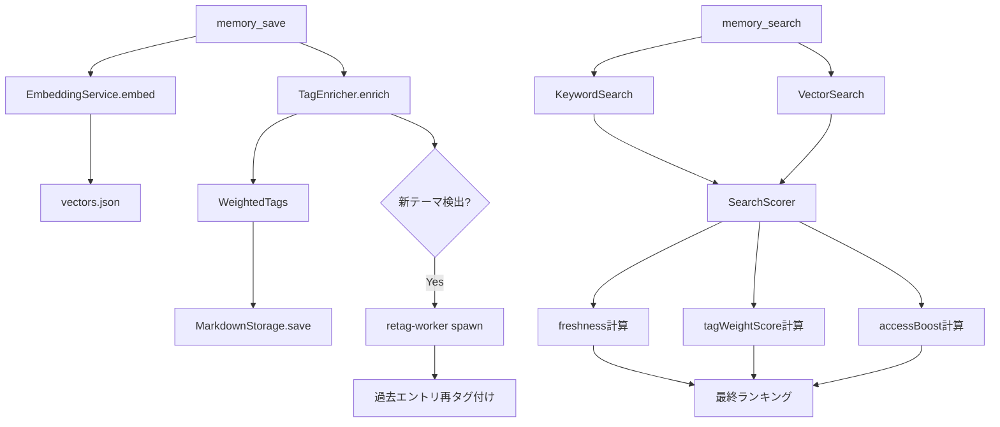

# Design Document - Smart Tag Retrieval

## Overview

記憶の検索精度を3つのアプローチで改善する: (1) 保存時のタグ拡張+重み付け、(2) テーマ変動時の過去エントリ再タグ付け、(3) freshness・タグ重み・アクセス頻度を複合したスコアリング。

データの削除や忘却は一切行わない。全記憶を高解像度で保持したまま、「取り出しの優先順位」のみを最適化する設計。

## Steering Document Alignment

### Technical Standards (tech.md)
- TypeScript strict mode、ESM、Node.js 18+
- Gemini APIはgenkit経由ではなく@google/generative-aiを直接使用（embedding同様）
- バックグラウンドワーカーはdetachedプロセス（consolidate-workerと同じパターン）

### Project Structure (structure.md)
- 新規モジュールは`src/`配下の適切なディレクトリに配置
- タグ拡張: `src/vector/tag-enricher.ts`（embedding生成と同階層）
- スコアリング: `src/vector/search-scorer.ts`（ベクトル検索と同階層）
- 再タグ付け: `src/cli/retag-worker.ts`（consolidate-workerと同階層）

## Code Reuse Analysis

### Existing Components to Leverage
- **EmbeddingService** (`src/vector/embedding-service.ts`): タグ拡張のGemini API呼び出しパターンを踏襲
- **VectorStore** (`src/vector/vector-store.ts`): accessCount管理、lastAccessedAt管理を拡張
- **MarkdownStorage** (`src/storage/markdown.ts`): タグ保存形式の拡張（WeightedTag対応）
- **consolidate-worker** (`src/cli/consolidate-worker.ts`): バックグラウンドワーカーのspawnパターンを再利用

### Integration Points
- **save.ts**: memory_save時にTagEnricher.enrich()を呼び出し
- **search.ts**: SearchScorer.score()による結果ランキング
- **vector-store.ts**: lastAccessedAt更新ロジックの追加
- **context.ts**: SessionStart Hook時のスコアリング適用

## Architecture



## Components and Interfaces

### Component 1: TagEnricher
- **Purpose:** 保存時にタグを拡張し、各タグに重みを付与する
- **Interfaces:**
  ```typescript
  class TagEnricher {
    async enrich(title: string, content: string, existingTags: string[]): Promise<{
      tags: WeightedTag[];
      newThemes: string[];  // 重み0.5以上の新テーマ
    }>
  }
  ```
- **Dependencies:** Gemini API（@google/generative-ai）
- **Reuses:** EmbeddingServiceのAPI呼び出しパターン

**Geminiへのプロンプト概要:**
- 入力: タイトル、コンテンツ、既存タグ
- 指示: 以下の観点でタグを7〜15個生成し、各タグに重みを付与
  - 具体的な事実値・固有名詞（ポート番号、API名、エラーコード）→ 高重み（0.8〜1.0）
  - 技術的な概念・操作名（rate-limit、認証、デプロイ）→ 中重み（0.5〜0.7）
  - 汎用カテゴリ（API、設定、バグ）→ 低重み（0.2〜0.4）
  - 類義語・関連概念（スロットリング↔rate-limit）→ 元の概念より低い重み
- 出力: JSON配列 `[{tag: string, weight: number}]`

### Component 2: SearchScorer
- **Purpose:** 検索結果に対してfreshness・タグ重み・アクセス頻度の複合スコアを算出する
- **Interfaces:**
  ```typescript
  class SearchScorer {
    static score(params: {
      vectorSimilarity: number;      // 0.0〜1.0（ベクトル検索の類似度。キーワードのみの場合は1.0）
      matchedTagWeights: number[];   // ヒットしたタグの重み配列
      daysSinceLastAccess: number;   // 最終アクセスからの経過日数
      accessCount: number;           // アクセス回数
      halfLifeDays?: number;         // 半減期（デフォルト: 14）
    }): number
  }
  ```
- **Dependencies:** なし（pure function）
- **Reuses:** なし（新規）

**スコア計算式:**
```
finalScore = vectorSimilarity * tagWeightScore * freshness * accessBoost

where:
  freshness    = max(0.7, e^(-0.693 * daysSinceLastAccess / halfLifeDays))
  tagWeightScore = matchedTagWeights.length > 0
                   ? 1.0 + sum(matchedTagWeights) / maxPossibleScore
                   : 1.0
  accessBoost  = min(1.2, 1.0 + accessCount * 0.04)
```

### Component 3: RetagWorker
- **Purpose:** 新テーマ検出時に関連する過去エントリを非同期で再タグ付けする
- **Interfaces:**
  ```typescript
  // CLIスクリプトとして実行（detached process）
  // 引数: newThemes[], memoryPath
  ```
- **Dependencies:** TagEnricher, VectorStore, MarkdownStorage
- **Reuses:** consolidate-workerのspawnパターン

**処理フロー:**
1. 新テーマをクエリとしてVectorStoreでベクトル検索（中期層まで）
2. ヒットした過去エントリ（最大20件）に対してTagEnricher.enrich()を実行
3. 既存タグとマージ（同名タグは重みの最大値を採用）
4. MarkdownStorage.save()で更新

### Component 4: WeightedTag Data Model

現在のタグ形式:
```markdown
- **tags**: Gemini, API, 仕様
```

拡張後のタグ形式:
```markdown
- **tags**: Gemini:0.3, rate-limit:0.9, API制限:0.8, 1000RPM:1.0, クォータ:0.7
```

**後方互換性**: 重みなしのタグ（`Gemini`）は重み1.0として扱う。パーサーは両形式に対応する。

## Data Models

### WeightedTag
```typescript
interface WeightedTag {
  tag: string;       // タグ文字列
  weight: number;    // 0.0〜1.0の重み
}
```

### MemoryEntry拡張（既存フィールドへの追加）
```typescript
interface MemoryEntry {
  // ... 既存フィールド
  tags: string[];           // 後方互換: "tag:weight" 形式の文字列配列
  // パース時にWeightedTag[]に変換
}
```

### VectorEntry拡張（既存フィールドへの追加）
```typescript
interface VectorEntry {
  // ... 既存フィールド
  lastAccessedAt: string;   // 既存（freshness計算に使用）
  accessCount: number;      // 既存（accessBoost計算に使用）
}
```

### ThemeRegistry（新規）
```typescript
// vectors.json内に追加 or 別ファイル
interface ThemeRegistry {
  themes: string[];          // 既知のテーマ一覧
  updatedAt: string;         // 最終更新日時
}
```

## Error Handling

### Error Scenarios
1. **タグ拡張のGemini API失敗**
   - **Handling:** 元のタグ（重みなし = 重み1.0扱い）で保存。stderrにエラー出力
   - **User Impact:** なし。保存は成功する

2. **再タグ付けワーカーの失敗**
   - **Handling:** 既存タグは一切変更されない。次回のフェーズ2トリガーで再試行
   - **User Impact:** なし。バックグラウンド処理

3. **不正な重み値（0未満、1超過）**
   - **Handling:** clamp(0.0, 1.0)で正規化
   - **User Impact:** なし

4. **後方互換: 重みなしタグの読み込み**
   - **Handling:** 重みなしタグは自動的に重み1.0として扱う
   - **User Impact:** なし。既存データがそのまま動作

## Testing Strategy

### Unit Testing
- SearchScorer.score(): 各要素（freshness, tagWeightScore, accessBoost）の計算精度
- TagEnricher: Geminiレスポンスのパース、エラー時のフォールバック
- WeightedTagのパース/フォーマット: "tag:0.8" ↔ {tag, weight}

### Integration Testing
- memory_save → タグ拡張 → memory_search → スコアリングの一連のフロー
- 新テーマ検出 → retag-worker起動 → 過去エントリ更新の一連のフロー

### End-to-End Testing
- 同じクエリで検索した際、最近保存した記憶が古い記憶より上位に来ること
- アクセス頻度の高い記憶が上位に浮上すること
- 新テーマ追加後、関連する過去エントリの検索精度が向上すること
