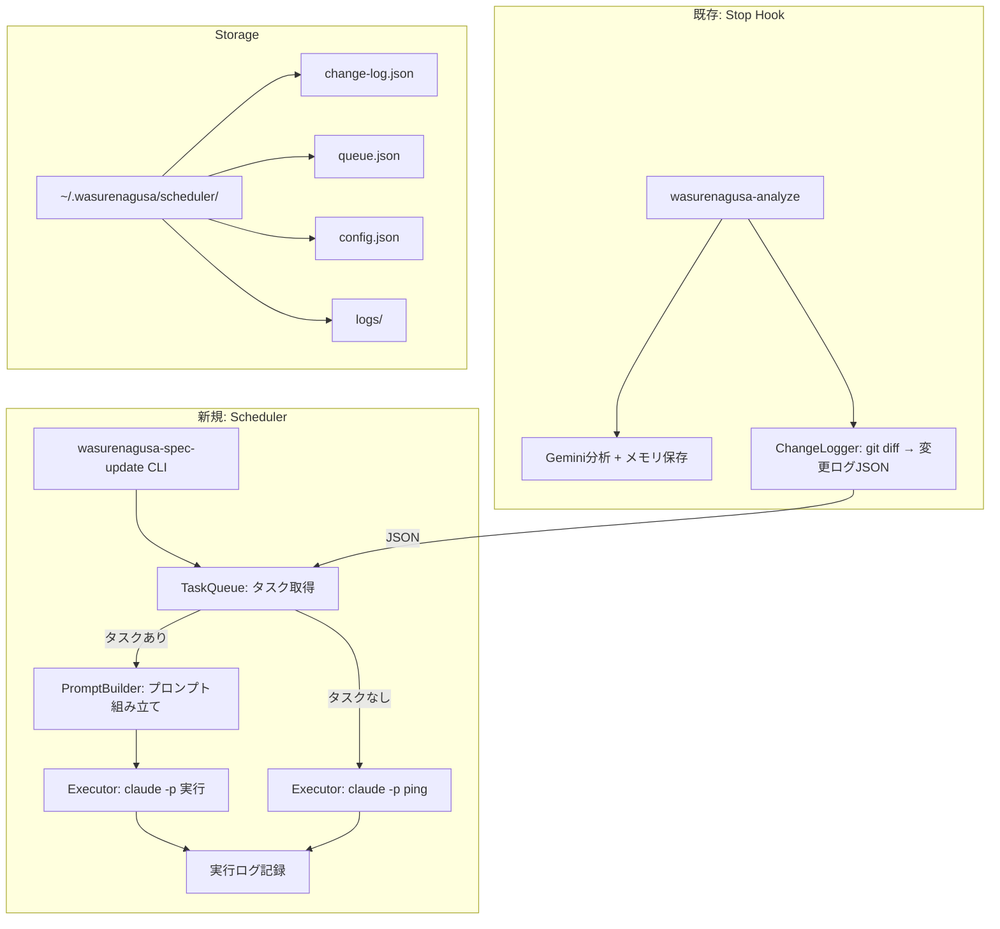

# Design Document: Spec Auto-Update

## Overview

Wasurenagusa MCPに「Spec自動更新」機能を追加する。既存のHooksアーキテクチャ（Stop Hook）に変更ログ記録を統合し、新規CLIバイナリ `wasurenagusa-spec-update` でcron/systemd timerからのバッチ実行を実現する。

本機能は既存のMCPサーバー機能とは独立したSchedulerレイヤーとして設計し、既存コードへの影響を最小化する。

## Steering Document Alignment

### Technical Standards (tech.md)
- **TypeScript ESM**: 既存と同一のモジュールシステム
- **ファイル構成パターン**: 既存のCLIスクリプト構成（cli/*.ts）に従う
- **プロンプト外部化**: 既存の `prompt-loader.ts` を再利用し `prompts/` からテンプレート読み込み
- **レイヤー分離**: 新規 Scheduler Layer を追加。既存レイヤーとの依存は `config.ts`, `utils/projectRoot.ts` のみ

### Project Structure (structure.md)
- `src/scheduler/` に新規モジュールを配置（既存パターンの `src/analyzer/`, `src/storage/` と同等）
- `src/cli/spec-update.ts` にCLIエントリポイント（既存の `context.ts`, `analyze.ts` と同等）
- `prompts/spec-update.txt`, `prompts/spec-rotation.txt` にプロンプトテンプレート

## Code Reuse Analysis

### Existing Components to Leverage
- **`src/analyzer/prompt-loader.ts`**: `loadPrompt(filename)` 関数でプロンプトテンプレートを読み込む
- **`src/utils/projectRoot.ts`**: `findProjectRoot(cwd)` でプロジェクトルート検出
- **`src/config.ts`**: 設定パターンを踏襲（Scheduler固有設定を追加）

### Integration Points
- **`src/cli/analyze.ts`**: Stop Hook実行時に変更ファイルログ記録を追加（main関数の末尾）。さらに最終セッション終了時刻を`last-session.json`に記録（スケジューラのアイドル判定用）
- **`package.json`**: `bin` フィールドに `wasurenagusa-spec-update` を追加

## Architecture



### Modular Design Principles
- **Single File Responsibility**: change-logger / task-queue / executor / prompt-builder は各1ファイル
- **Component Isolation**: Schedulerモジュールは既存のMCPサーバー・Analyzer・Storageと独立
- **Service Layer Separation**: データ（queue.json, change-log.json）とロジック（TaskQueue, ChangeLogger）を分離

## Components and Interfaces

### Component 1: ChangeLogger
- **Purpose:** セッション中の変更ファイルを検出し、変更ログに記録する
- **File:** `src/scheduler/change-logger.ts`
- **Interfaces:**
  ```typescript
  interface ChangeLogEntry {
    timestamp: string;        // ISO 8601
    project: string;          // プロジェクト名（ディレクトリ名）
    projectPath: string;      // プロジェクト絶対パス
    changedFiles: string[];   // 変更ファイル名一覧（相対パス）
    specPaths: SpecPaths;     // Specドキュメントパス
  }

  interface SpecPaths {
    steering: string;         // .spec-workflow/steering/ のパス
    specs: string[];          // .spec-workflow/specs/*/  のパス一覧
  }

  class ChangeLogger {
    constructor(schedulerDir: string);
    async recordChanges(projectPath: string): Promise<ChangeLogEntry | null>;
    async getEntries(): Promise<ChangeLogEntry[]>;
    async consumeEntry(timestamp: string): Promise<void>;
  }
  ```
- **Dependencies:** Node.js `child_process`（git実行）, `fs/promises`
- **Reuses:** `findProjectRoot()`

### Component 2: TaskQueue
- **Purpose:** Spec更新タスクを優先度付きで管理する
- **File:** `src/scheduler/task-queue.ts`
- **Interfaces:**
  ```typescript
  type TaskType = "change-based" | "rotation" | "ping" | "autonomous";
  type TaskStatus = "pending" | "in-progress" | "completed" | "failed";

  interface SchedulerTask {
    id: string;               // UUID
    type: TaskType;
    priority: number;         // 1(高) - 3(低)
    project: string;
    projectPath: string;
    specPaths: SpecPaths;
    changedFiles?: string[];  // change-basedの場合のみ
    status: TaskStatus;
    createdAt: string;
    completedAt?: string;
    error?: string;
  }

  class TaskQueue {
    constructor(schedulerDir: string);
    async buildQueue(changeEntries: ChangeLogEntry[], projectConfigs: ProjectConfig[]): Promise<void>;
    async dequeue(): Promise<SchedulerTask | null>;
    async dequeueAll(): Promise<SchedulerTask[]>;
    async markComplete(taskId: string): Promise<void>;
    async markFailed(taskId: string, error: string): Promise<void>;
    async getStatus(): Promise<{ pending: number; completed: number; failed: number }>;
  }
  ```
- **Dependencies:** `fs/promises`, `crypto`（UUID生成）

### Component 3: Executor
- **Purpose:** Claude Code CLIをヘッドレスモードで実行する
- **File:** `src/scheduler/executor.ts`
- **Interfaces:**
  ```typescript
  interface ExecutionResult {
    exitCode: number;
    stdout: string;
    stderr: string;
    durationMs: number;
  }

  interface ClaudeCliOptions {
    maxTurns: number;           // デフォルト: 50
    allowedTools: string[];     // デフォルト: ["Edit","Write","Read","Glob","Grep"]
    timeoutMs: number;          // デフォルト: 600000 (10分)
  }

  class Executor {
    async runSpecUpdate(prompt: string, cwd: string, options?: Partial<ClaudeCliOptions>): Promise<ExecutionResult>;
    async ping(timeoutMs?: number): Promise<ExecutionResult>;
    async isClaudeAvailable(): Promise<boolean>;
  }
  ```
- **Dependencies:** Node.js `child_process`（execFile）
- **Note:** `claude -p` はstdinからプロンプトを受け取るか、引数で渡す。`--print`フラグでストリーミングなし出力

### Component 4: PromptBuilder
- **Purpose:** Spec更新用プロンプトをテンプレートから組み立てる
- **File:** `src/scheduler/prompt-builder.ts`
- **Interfaces:**
  ```typescript
  class PromptBuilder {
    async buildChangeBasedPrompt(task: SchedulerTask): Promise<string>;
    async buildRotationPrompt(task: SchedulerTask): Promise<string>;
  }
  ```
- **Dependencies:** なし（純粋関数）
- **Reuses:** `loadPrompt()` from `analyzer/prompt-loader.ts`

### Component 5: SchedulerConfig
- **Purpose:** スケジューラ設定の管理（プロジェクト一覧、パス設定）
- **File:** `src/types.ts`（型定義部分）
- **Interfaces:**
  ```typescript
  interface ProjectConfig {
    name: string;
    path: string;
    specPaths: SpecPaths;
    lastUpdated?: string;     // 最終Spec更新日
  }

  interface SchedulerConfig {
    projects: ProjectConfig[];
    cycleMinutes: number;     // デフォルト: 305（5h5m）
    taskTimeoutMs: number;    // デフォルト: 600000（10分）
    pingTimeoutMs: number;    // デフォルト: 30000（30秒）
    rotationThresholdDays: number; // デフォルト: 7（ローテーション更新の閾値日数）
    idleThresholdMinutes: number;  // デフォルト: 150（ユーザーアイドル判定の閾値分）
    maxConcurrentTasks: number;    // デフォルト: 3（タスク並列実行上限）
    activeHourStart?: number;      // 廃止（後方互換のためoptionalで残置）
    activeHourEnd?: number;        // 廃止（後方互換のためoptionalで残置）
    subProjectParents?: string[];  // サブプロジェクト持ち親ディレクトリ名（例: ["bengo4-labo"]）
  }
  ```

### Component 6: CLI Entry (`wasurenagusa-spec-update`)
- **Purpose:** cronから呼び出されるCLIエントリポイント
- **File:** `src/cli/spec-update.ts`
- **Subcommands:**
  - `--run`: 全タスクを並行実行（デフォルト動作）。自律タスク・Spec更新タスクをそれぞれ全件dequeueし、`maxConcurrentTasks`（デフォルト3）で並列数を制限して実行
  - `--status`: キュー状態・最終実行結果の表示
  - `--setup`: cron/launchd設定の生成（対話なし、設定ファイル出力）
- **Dependencies:** 全Schedulerコンポーネント + autonomous/モジュール群

## Data Models

### ChangeLog (`~/.wasurenagusa/scheduler/change-log.json`)
```json
[
  {
    "timestamp": "2026-02-14T14:30:00+09:00",
    "project": "my-project",
    "projectPath": "/Users/dev/projects/my-project",
    "changedFiles": ["src/api/handler.ts", "src/models/user.ts"],
    "specPaths": {
      "steering": "/Users/dev/projects/my-project/.spec-workflow/steering",
      "specs": ["/Users/dev/projects/my-project/.spec-workflow/specs/feature-a"]
    }
  }
]
```

### TaskQueue (`~/.wasurenagusa/scheduler/queue.json`)
```json
[
  {
    "id": "550e8400-e29b-41d4-a716-446655440000",
    "type": "change-based",
    "priority": 1,
    "project": "my-project",
    "projectPath": "/Users/dev/projects/my-project",
    "specPaths": { "steering": "...", "specs": ["..."] },
    "changedFiles": ["src/api/handler.ts"],
    "status": "pending",
    "createdAt": "2026-02-14T03:00:00+09:00"
  }
]
```

### SchedulerConfig (`~/.wasurenagusa/scheduler/config.json`)
```json
{
  "projects": [
    {
      "name": "my-project",
      "path": "/Users/dev/projects/my-project",
      "specPaths": {
        "steering": ".spec-workflow/steering",
        "specs": [".spec-workflow/specs/feature-a"]
      },
      "lastUpdated": "2026-02-10T03:00:00+09:00"
    }
  ],
  "cycleMinutes": 305,
  "taskTimeoutMs": 600000,
  "pingTimeoutMs": 30000
}
```

### ExecutionLog (`~/.wasurenagusa/scheduler/logs/YYYY-MM-DD.json`)
```json
[
  {
    "timestamp": "2026-02-14T03:00:00+09:00",
    "taskId": "550e8400-...",
    "type": "change-based",
    "project": "my-project",
    "exitCode": 0,
    "durationMs": 45000,
    "summary": "Updated architecture.md and tech.md based on API handler changes"
  }
]
```

## Error Handling

### Error Scenarios
1. **`claude` コマンドが見つからない**
   - **Handling:** `Executor.isClaudeAvailable()` でPATH確認。見つからない場合はエラーメッセージ出力して終了
   - **User Impact:** `wasurenagusa-spec-update` 実行時にエラーメッセージ表示。メモリ機能には影響なし

2. **Claude Code CLI実行がタイムアウト**
   - **Handling:** `taskTimeoutMs`（デフォルト10分）でkill。タスクをfailedマーク
   - **User Impact:** 次サイクルで別タスクが実行される。失敗タスクはログに残る

3. **変更ログJSONが破損**
   - **Handling:** JSONパースエラーをcatch → 空の配列として再初期化
   - **User Impact:** 破損分の変更ログは失われるが、次セッションから正常記録再開

4. **同時実行（cron重複）**
   - **Handling:** ロックファイル（`~/.wasurenagusa/scheduler/.lock`）で排他制御。ロック取得失敗時は即終了
   - **User Impact:** 重複実行なし。次サイクルで正常実行

5. **git diffが失敗（非gitプロジェクト等）**
   - **Handling:** execFileのエラーをcatch → 変更ログ記録をスキップ
   - **User Impact:** そのセッションの変更記録はスキップされるが、他の機能に影響なし

6. **5時間レート制限に到達**
   - **Handling:** Claude CLIが非ゼロ終了コードを返す → タスクをfailedマーク → 次サイクルでリトライ
   - **User Impact:** タスクが次サイクルに持ち越される

## Testing Strategy

### Unit Testing
- **ChangeLogger**: git diffモック、JSONファイル読み書きテスト、エッジケース（変更なし、.gitなし）
- **TaskQueue**: キュー操作（enqueue/dequeue/markComplete/markFailed）、優先度ソート、空キュー
- **Executor**: child_processモック、タイムアウト、exitCode処理
- **PromptBuilder**: テンプレート変数置換、テンプレートファイル読み込み

### Integration Testing
- **analyze.ts統合**: Stop Hook実行 → 変更ログ記録の一連フロー
- **spec-update CLI統合**: キュービルド → タスク実行の一連フロー（Executor はモック）

### End-to-End Testing
- **手動E2E**: 実際のプロジェクトで `wasurenagusa-spec-update --run` を実行し、Specが更新されることを確認
- **cron統合**: launchd/cronからの実行で正常動作することを確認
