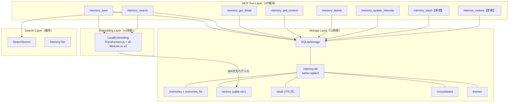

# Design Document: storage-engine-v2

## Overview

wasurenagusa-mcpのストレージ層をマークダウンファイル→SQLite、embedding生成をGemini API→ローカル推論（Transformers.js）に刷新する。MCPツール・Hooks CLIのインターフェースは維持。

## Steering Document Alignment

### Technical Standards

- **Language**: TypeScript 5.x + Node.js 18以上 (ES2022, ESM)
- **Database**: better-sqlite3（同期API、Node.js native addon）
- **Vector Extension**: sqlite-vec（sqlite-vecのnpmパッケージ）
- **Full-text Search**: SQLite FTS5（built-in）
- **Local Embedding**: @huggingface/transformers v4 + all-MiniLM-L6-v2（384次元）

### Project Structure (v2での変更)

```
src/
├── storage/
│   ├── index.ts              # StorageEngine公開インターフェース（v2: SQLite実装をexport）
│   ├── sqlite.ts             # 【v2新規】SQLiteStorage（MarkdownStorageの置き換え）
│   ├── schema.ts             # 【v2新規】DDL定義・テーブル作成
│   ├── migration.ts          # 【v2新規】v1→v2マイグレーション
│   ├── markdown.ts           # 【維持】v1 MarkdownStorage（マイグレーション元として参照）
│   ├── parser.ts             # 【維持】v1 Markdownパーサー（マイグレーション時に使用）
│   └── formatter.ts          # 【維持】v1フォーマッター（マイグレーション時に使用）
├── vector/
│   ├── local-embedding.ts    # 【v2新規】ローカルembedding（Transformers.js）
│   ├── embedding-service.ts  # 【廃止予定】Gemini Embedding（v2ではlocal-embeddingに置き換え）
│   ├── vector-store.ts       # 【廃止予定】JSON VectorStore（v2ではSQLiteに統合）
│   ├── cosine-distance.ts    # 【維持】コサイン距離計算（sqlite-vecのフォールバック用）
│   ├── memory-tier.ts        # 【維持】記憶階層フィルタリング
│   ├── search-scorer.ts      # 【維持】検索スコアリング（入力I/F変更なし）
│   ├── tag-enricher.ts       # 【維持】タグ拡張（LLM依存は変更なし）
│   ├── theme-registry.ts     # 【v2変更】JSON→SQLiteバックエンドに切り替え
│   └── weighted-tag.ts       # 【維持】重み付きタグ
├── tools/
│   ├── stash.ts              # 【v2新規】memory_stash ツール
│   ├── restore.ts            # 【v2新規】memory_restore ツール
│   └── (既存ツール)          # 【v2変更】MarkdownStorage→SQLiteStorageに差し替え
├── consolidator/
│   ├── staleness.ts          # 【v2変更】ファイルstat→SQLiteメタデータで鮮度判定
│   └── (既存)               # 【維持】LLM統合ロジックは変更なし
└── cli/
    └── (既存)               # 【v2変更】内部のStorage参照をSQLiteStorageに切り替え
```

## Code Reuse Analysis

### firebase-kitからの利用可能機能

firebase-kitのexport一覧を確認した結果、wasurenagusa-mcpはMCPサーバー（CLIツール/STDIOトランスポート）であり、Firebase/Firestore/Cloud Functionsを使用しない。firebase-kitの主要機能（CRUD、認証、ミドルウェア、LLMProvider等）は全てFirebaseエコシステム前提のため、**直接利用できる機能はない**。

| firebase-kit機能 | 利用可否 | 理由 |
|---|---|---|
| LLMProvider/GeminiProvider | 不可 | genkit前提。wasurenagusaは独自のgenkit統合（llm/provider.ts）を持つ |
| CRUD (createDocument等) | 不可 | Firestore前提 |
| Secret Manager | 不可 | GCP Secret Manager前提。wasurenagusaは.envファイル |
| SlackClient | 不可 | wasurenagusaは独自のSlack通知（autonomous/notifier.ts）を持つ |
| PromptBuilder | 不可 | firebase-kitのPromptBuilderはFirestore統合。wasurenagusaは独自のprompt-loader |

### wasurenagusa-mcp内の既存コンポーネント再利用

| コンポーネント | v2での扱い | 理由 |
|---|---|---|
| `storage/parser.ts` | 再利用（マイグレーション時） | v1のmdファイルをパースしてSQLiteに投入 |
| `storage/markdown.ts` | 再利用（マイグレーション時） | v1データ読み出し元 |
| `vector/search-scorer.ts` | そのまま維持 | スコアリングロジックはストレージ非依存 |
| `vector/cosine-distance.ts` | そのまま維持 | sqlite-vecフォールバック用 |
| `vector/memory-tier.ts` | そのまま維持 | 閾値定義はストレージ非依存 |
| `vector/weighted-tag.ts` | そのまま維持 | タグフォーマットはストレージ非依存 |
| `vector/tag-enricher.ts` | そのまま維持 | LLMタグ拡張はストレージ非依存 |
| `llm/provider.ts` | そのまま維持 | LLMプロバイダーはストレージ非依存 |
| `consolidator/dont-consolidator.ts` | そのまま維持 | LLM統合ロジックはストレージ非依存 |
| `consolidator/config-consolidator.ts` | そのまま維持 | 同上 |
| `types.ts` | 拡張 | StashEntry等の新型を追加 |

## Architecture

### 全体構成（v2）



### SQLiteスキーマ設計

```sql
-- WALモード有効化（初期化時に実行）
PRAGMA journal_mode = WAL;
PRAGMA busy_timeout = 5000;
PRAGMA foreign_keys = ON;

-- メモリエントリ本体
CREATE TABLE memories (
    id TEXT PRIMARY KEY,
    timestamp TEXT NOT NULL,          -- ISO 8601 JST
    category TEXT NOT NULL CHECK(category IN ('config','dont','decision','log','snippet')),
    title TEXT NOT NULL,
    content TEXT NOT NULL,
    tags TEXT NOT NULL DEFAULT '[]',  -- JSON配列（WeightedTag対応: '["tag:0.8", "tag2:0.5"]'）
    project TEXT,
    scope TEXT,
    intensity INTEGER,
    created_at TEXT NOT NULL DEFAULT (datetime('now')),
    updated_at TEXT NOT NULL DEFAULT (datetime('now'))
);

-- インデックス
CREATE INDEX idx_memories_category ON memories(category);
CREATE INDEX idx_memories_project ON memories(project);
CREATE INDEX idx_memories_timestamp ON memories(timestamp DESC);

-- FTS5全文検索（日本語の部分文字列マッチに対応するためtrigramを採用）
CREATE VIRTUAL TABLE memories_fts USING fts5(
    title,
    content,
    tags,
    content=memories,
    content_rowid=rowid,
    tokenize='trigram'
);

-- FTS5同期トリガー
CREATE TRIGGER memories_ai AFTER INSERT ON memories BEGIN
    INSERT INTO memories_fts(rowid, title, content, tags)
    VALUES (new.rowid, new.title, new.content, new.tags);
END;
CREATE TRIGGER memories_ad AFTER DELETE ON memories BEGIN
    INSERT INTO memories_fts(memories_fts, rowid, title, content, tags)
    VALUES ('delete', old.rowid, old.title, old.content, old.tags);
END;
CREATE TRIGGER memories_au AFTER UPDATE ON memories BEGIN
    INSERT INTO memories_fts(memories_fts, rowid, title, content, tags)
    VALUES ('delete', old.rowid, old.title, old.content, old.tags);
    INSERT INTO memories_fts(rowid, title, content, tags)
    VALUES (new.rowid, new.title, new.content, new.tags);
END;

-- ベクトルテーブル（sqlite-vec拡張）
CREATE VIRTUAL TABLE vectors USING vec0(
    id TEXT PRIMARY KEY,
    embedding float[384]
);

-- ベクトルメタデータ（アクセス追跡）
CREATE TABLE vector_metadata (
    id TEXT PRIMARY KEY,
    access_count INTEGER NOT NULL DEFAULT 0,
    created_at TEXT NOT NULL DEFAULT (datetime('now')),
    last_accessed_at TEXT NOT NULL DEFAULT (datetime('now')),
    FOREIGN KEY (id) REFERENCES memories(id) ON DELETE CASCADE
);

-- 短期退避テーブル
CREATE TABLE stash (
    id TEXT PRIMARY KEY,
    content TEXT NOT NULL,             -- 退避されたファイル全文
    summary TEXT NOT NULL,             -- ルールベース要約
    file_path TEXT,                    -- 元ファイルパス（オプション）
    file_type TEXT,                    -- ファイル拡張子
    line_count INTEGER,                -- 行数
    session_id TEXT,                   -- セッションID
    created_at TEXT NOT NULL DEFAULT (datetime('now')),
    expires_at TEXT NOT NULL           -- TTL: created_at + 24h
);

CREATE INDEX idx_stash_expires ON stash(expires_at);

-- 統合キャッシュ
CREATE TABLE consolidated (
    type TEXT PRIMARY KEY CHECK(type IN ('dont','config')),
    data TEXT NOT NULL,                -- JSON（ConsolidatedDont | ConsolidatedConfig）
    source_entry_count INTEGER NOT NULL,
    consolidated_at TEXT NOT NULL,
    version INTEGER NOT NULL DEFAULT 1
);

-- テーマレジストリ
CREATE TABLE themes (
    name TEXT PRIMARY KEY,
    created_at TEXT NOT NULL DEFAULT (datetime('now'))
);

-- セッショントピック
CREATE TABLE session_topics (
    project TEXT NOT NULL,
    topic TEXT NOT NULL,
    session_at TEXT NOT NULL,
    PRIMARY KEY (project)
);

-- スキーマバージョン管理
CREATE TABLE schema_version (
    version INTEGER PRIMARY KEY,
    applied_at TEXT NOT NULL DEFAULT (datetime('now'))
);
```

### データフロー

#### memory_save フロー

```
save呼び出し
  → TagEnricher.enrich（LLM、既存通り）
  → LocalEmbedding.embed（ローカル、384次元）
  → SQLiteStorage.save（BEGIN→INSERT memories→INSERT vectors→INSERT vector_metadata→COMMIT）
  → ThemeRegistry.addThemes（SQLite themes テーブル）
  → 新テーマ時: spawnRetagWorker（既存通り）
```

#### memory_search フロー

```
search呼び出し
  → LocalEmbedding.embed（クエリベクトル化）
  → SQLiteStorage.searchHybrid:
      1. FTS5全文検索: SELECT ... FROM memories_fts WHERE memories_fts MATCH ?
      2. ベクトル検索: SELECT ... FROM vectors WHERE embedding MATCH ? AND k = ?
      3. 結果マージ（ID UNION）
      4. projectフィルタ / scopeフィルタ
  → SearchScorer.score（既存ロジック維持）
  → ベクトルメタデータ更新（access_count++, last_accessed_at）
  → critical昇格チェック（既存ロジック維持）
  → 軽量インデックス返却
```

#### memory_stash フロー

```
stash呼び出し
  → ルールベース要約生成:
      summary = 先頭5行 + "... (全{N}行, {fileType})"
  → SQLiteStorage.stash:
      INSERT INTO stash (id, content, summary, ..., expires_at)
      VALUES (?, ?, ?, ..., datetime('now', '+24 hours'))
  → 要約のみ返却（フル内容はDBに退避済み）
```

#### memory_restore フロー

```
restore呼び出し
  → TTL確認: SELECT ... FROM stash WHERE id = ? AND expires_at > datetime('now')
  → 存在 & 未期限切れ: フル内容返却
  → 期限切れ or 不在: エラーメッセージ返却
```

## Components and Interfaces

### SQLiteStorage（新規）

```typescript
// src/storage/sqlite.ts

export class SQLiteStorage {
  private db: Database;  // better-sqlite3

  constructor(dbPath: string);

  // 初期化: DDL実行、WAL有効化、マイグレーション判定
  initialize(): void;

  // MemoryEntry CRUD（既存I/F互換）
  save(params: SaveParams): SaveResult;
  search(params: SearchParams): SearchResult;
  getDetail(params: GetDetailParams): GetDetailResult;
  getContext(currentProject?: string): ContextResult;
  delete(params: DeleteParams): DeleteResult;
  updateIntensity(id: string, intensity: number): { success: boolean; id: string; category: MemoryCategory };

  // config/dontエントリ直接読み出し（consolidator用）
  readConfigEntries(currentProject?: string): MemoryEntry[];
  readDontEntries(currentProject?: string): MemoryEntry[];

  // ベクトル操作
  upsertVector(id: string, embedding: number[]): void;
  deleteVectors(ids: string[]): void;
  searchVectors(queryEmbedding: number[], threshold: number, limit: number): VectorSearchResult[];
  incrementAccessCount(ids: string[]): void;
  getEntriesWithoutEmbedding(): string[];
  getVectorMetadata(ids: string[]): Map<string, { lastAccessedAt: string; accessCount: number }>;

  // Stash操作
  stash(params: StashParams): StashResult;
  restore(id: string): RestoreResult;
  cleanExpiredStash(): number;  // TTL超過データ削除、削除件数を返す

  // 統合キャッシュ
  readConsolidated(type: 'dont' | 'config'): ConsolidatedDont | ConsolidatedConfig | null;
  writeConsolidated(type: 'dont' | 'config', data: ConsolidatedDont | ConsolidatedConfig): void;
  isConsolidationStale(type: 'dont' | 'config'): boolean;

  // テーマ
  getThemes(): string[];
  addThemes(themes: string[]): void;
  isNewTheme(theme: string): boolean;

  // セッショントピック
  getSessionTopic(project: string): string | null;
  setSessionTopic(project: string, topic: string): void;

  // マイグレーション
  needsMigration(): boolean;

  // DB管理
  close(): void;
}
```

### LocalEmbedding（新規）

```typescript
// src/vector/local-embedding.ts

export const EMBEDDING_DIMENSIONS = 384;

export class LocalEmbedding {
  private pipeline: Pipeline | null;
  private modelDir: string;

  constructor(modelDir: string);  // '.wasurenagusa/models/'

  // モデルロード（初回はダウンロード）
  async initialize(): Promise<void>;

  // 利用可能かどうか（モデルロード済みか）
  isAvailable(): boolean;

  // 単一テキストのembedding
  async embed(text: string): Promise<number[]>;

  // バッチembedding
  async embedBatch(texts: string[]): Promise<number[][]>;
}
```

### StashParams / StashResult（新規型）

```typescript
// types.tsに追加

export interface StashParams {
  content: string;           // 退避するファイル全文
  filePath?: string;         // 元ファイルパス（オプション）
  fileType?: string;         // ファイル拡張子（オプション）
  sessionId?: string;        // セッションID（オプション）
  ttlHours?: number;         // TTL時間（デフォルト24）
}

export interface StashResult {
  id: string;
  summary: string;           // ルールベース要約
  expiresAt: string;         // 有効期限（ISO 8601）
}

export interface RestoreResult {
  found: boolean;
  content?: string;          // フル内容（found=true時）
  expired?: boolean;         // TTL超過で見つからなかった場合true
  message: string;
}
```

### Schema初期化（新規）

```typescript
// src/storage/schema.ts

export const CURRENT_SCHEMA_VERSION = 1;

// DDL文字列定数
export const DDL: string;

// テーブル作成・WAL設定
export function initializeSchema(db: Database): void;

// スキーマバージョン確認
export function getSchemaVersion(db: Database): number;
```

### Migration（新規）

```typescript
// src/storage/migration.ts

// v1のmdファイル + vectors.jsonをSQLiteに移行
export async function migrateV1ToV2(
  db: Database,
  memoryPath: string,
): Promise<{ entriesCount: number; vectorsCount: number }>;
```

## Error Handling

### エラー方針（_common-rules.md準拠）

- **catchしたら必ず再throw**: SQLiteエラーは文脈付与して再throw
- **フォールバック代入禁止**: DBアクセス失敗時に空配列を返さない
- **例外**: ベクトル検索失敗時のみキーワード検索結果で続行（REQ-V2-2 AC4）

### エラーシナリオ

| シナリオ | 対応 |
|---|---|
| SQLiteファイル作成失敗（権限不足） | エラーをそのまま上位伝播 |
| better-sqlite3のDATABASE_LOCKED | busy_timeout(5000ms)で自動リトライ。超過時はエラー伝播 |
| FTS5クエリ構文エラー | エラーログ出力→再throw |
| sqlite-vec拡張ロード失敗 | エラーログ出力→再throw（ベクトル検索不能） |
| Transformers.jsモデルダウンロード失敗 | エラーログ出力→再throw。キーワード検索にフォールバック |
| マイグレーション中のエラー | トランザクションROLLBACK。v1データは残る |
| stash TTL超過でrestore | `{ found: false, expired: true, message: "..." }` で通知 |

## Testing Strategy

### Unit Testing

- **SQLiteStorage**: 一時ディレクトリでの実DB操作テスト（インメモリDB `:memory:` は本番との差異が出るため不使用）
- **LocalEmbedding**: モデルロード・embed結果の次元数検証
- **Migration**: テスト用v1ファイル→SQLite変換の正確性
- **Schema**: DDL実行・テーブル存在確認

### Integration Testing

- **save→search→getDetail**: SQLite経由のEnd-to-End
- **save→embed→vectorSearch**: ローカルembedding経由のベクトル検索
- **stash→restore**: TTL内外の動作確認
- **migration**: 実際のv1ファイルからのマイグレーション

## Dependencies (新規追加)

```json
{
  "better-sqlite3": "^11.x",
  "sqlite-vec": "^0.1.x",
  "@huggingface/transformers": "^3.x"
}
```

```json
{
  "@types/better-sqlite3": "^7.x"
}
```
