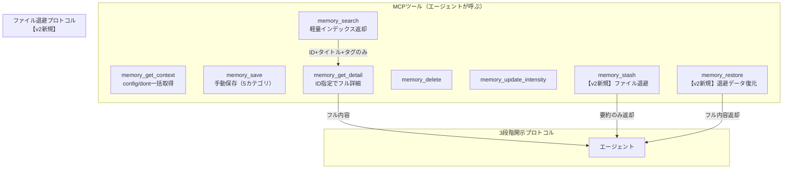
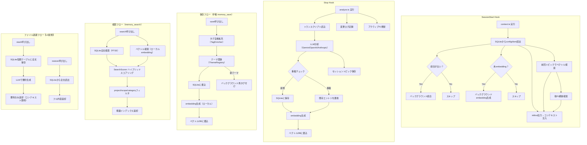
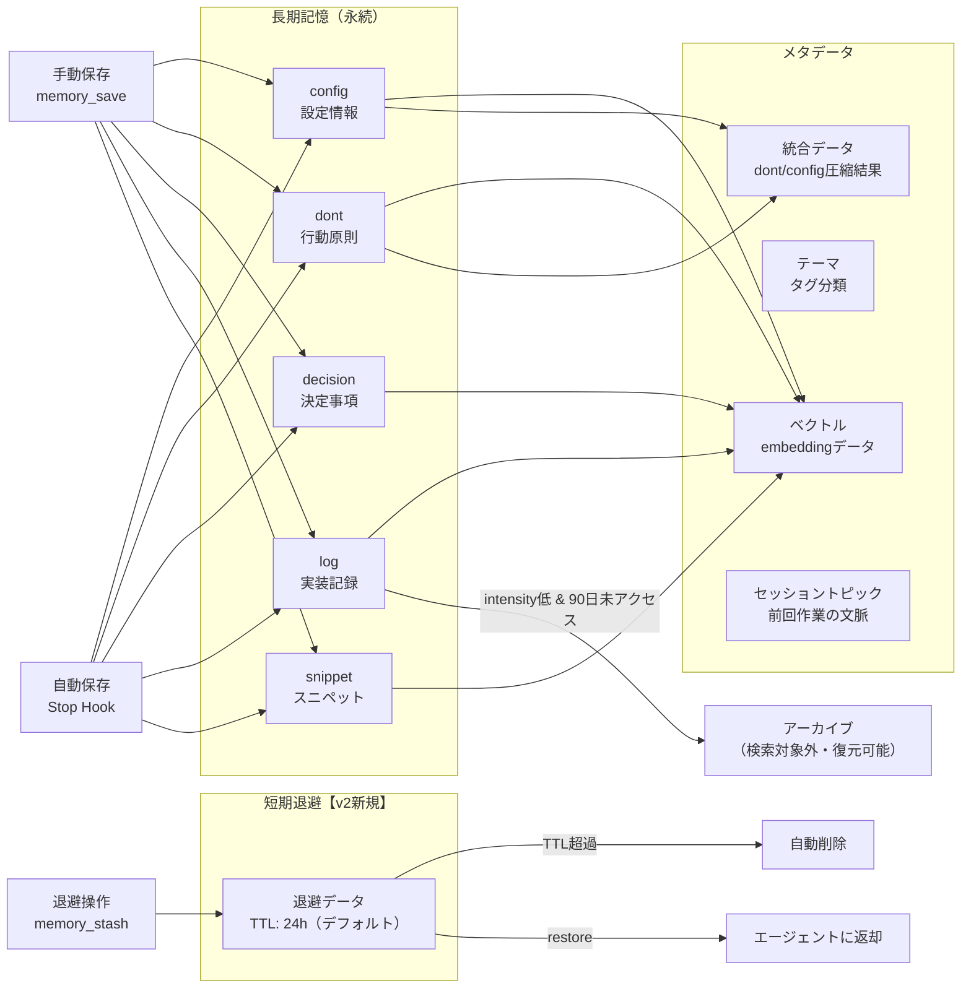

# Wasurenagusa v2 サービスフロー設計

## サービスブループリント

### 1. 登場人物

| 役割 | 誰 | サービスとの関わり方 |
|------|-----|-------------------|
| 直接ユーザー | AIコーディングエージェント（Claude Code等） | MCPツール経由で記憶の保存・検索・取得を行う。Hooks経由でコンテキスト注入・セッション分析を受ける |
| 間接ユーザー | 人間の開発者（オーナー） | エージェントを通じて記憶の恩恵を受ける。memory_saveで手動保存を指示することもある |
| 運用者 | なし（完全自律運用） | 人間の運用介入は不要。セットアップ後は自動で動く |
| システム: Hooks | SessionStart / Stop / UserPromptSubmit | セッションライフサイクルに連動して自動実行 |
| システム: Scheduler | スケジューラ + 自律タスク実行 | アイドル時にSpec自動更新・タスク実行 |
| システム: SQLite | ローカルデータベース（v2新規） | 記憶・ベクトル・短期退避の統合ストレージ |

### 2. 時系列フロー

```
時間軸:  セッション開始 ──── 作業中 ──────────── セッション終了 ──── アイドル時
         ↓                  ↓                     ↓                  ↓
Agent:   コンテキスト受取    search→get_detail      -                  -
         ファイル退避確認    save（手動）            -                  -
                            stash（ファイル退避）
                            restore（復元）
Hooks:   context注入         -                     analyze→自動保存    -
         統合バックグラウンド                       トピックembedding
         backfillバックグラウンド                   アクティブPJ更新
Scheduler: -                -                      -                  Spec更新
                                                                      自律タスク
SQLite:  config/dont読出     全文+ベクトル検索      書き込み            -
         ベクトル検索         退避データ読み書き     embedding生成
         短期退避データ確認
```

### 3. 三層ブループリント

#### フロントステージ（エージェントに見える部分）



#### バックステージ（エージェントに見えない処理）



#### 支援プロセス（インフラ・運用）

| 項目 | v1（現行） | v2（新規） |
|------|-----------|-----------|
| データ保存 | マークダウンファイル（.wasurenagusa/*.md） | SQLite単一ファイル（.wasurenagusa/memory.db） |
| ベクトル保存 | vectors.json（全件JSONファイル） | SQLite内ベクトルテーブル |
| embedding生成 | Gemini API（外部依存） | ローカルembeddingモデル（外部依存ゼロ） |
| 全文検索 | 文字列マッチ（Array走査） | SQLite FTS5 |
| 短期退避 | なし | SQLite短期テーブル（TTL付き） |
| 統合（consolidation） | LLM呼び出し→JSONファイル保存 | LLM呼び出し→SQLite保存 |
| バックアップ | なし（mdファイルがgit管理可） | SQLiteファイルコピー（.wasurenagusa/memory.db） |

### 4. 失敗フロー

| 失敗パターン | 影響範囲 | リカバリ手段 |
|------------|---------|------------|
| **SQLiteファイル破損** | 全記憶データ喪失 | WALモード有効化で書込中断に耐性。定期バックアップ（memory.db.bak）。v1のmdファイルからのマイグレーション再実行で復元 |
| **ローカルembeddingモデル読込失敗** | ベクトル検索が不可。キーワード検索は動作する | キーワード検索にフォールバック。次回起動時にモデル再読込を試行 |
| **セッション開始時のDB読込失敗** | コンテキスト注入ゼロ（記憶なしで動作） | エラーログ出力。エージェントはmemory_get_contextで手動再取得可能 |
| **Stop Hook分析のLLM呼び出し失敗** | 自動保存がスキップされる | 次セッション終了時に再試行される（冪等性確保）。手動memory_saveは影響なし |
| **embedding生成のタイムアウト** | 該当エントリのベクトル検索不可 | backfillワーカーが次回セッション開始時に未生成分を埋める |
| **同時書込（並列セッション）** | データ不整合のリスク | SQLiteのWALモード + SERIALIZABLE分離レベルで保護。5秒のbusy_timeout設定 |
| **短期退避データのTTL超過** | 退避したファイルが自動削除される | TTLは24時間（デフォルト）。restore前にTTL確認。超過時はエラーメッセージで通知 |
| **DBマイグレーション失敗** | v1→v2移行が中断 | トランザクション内で実行。失敗時はv1のmdファイルがそのまま残る。再実行可能 |
| **想定外のデータ量（1万件超）** | 検索レイテンシ増加 | SQLite FTS5はO(log N)。ベクトル検索はインデックスで高速化。intensity低い古い記憶は自動アーカイブ |

### 5. 影響範囲

#### 上流への影響（このサービスにデータを渡す側）

| 上流 | 変更の必要性 |
|------|------------|
| Claude Code Hooks設定 | **変更不要**。context.ts / analyze.tsのCLI I/Fは維持 |
| MCPツール定義（inputSchema） | **変更不要**。ツール名・パラメータは全て維持。stash/restoreのみ追加 |
| LLM分析（Analyzer） | **変更不要**。AnalysisResult型は維持 |
| owner-profile.md | **変更不要**。テキストファイルのまま維持 |

#### 下流への影響（このサービスの結果を受け取る側）

| 下流 | 変更の必要性 |
|------|------------|
| エージェントのコンテキスト窓 | **改善**。ファイル退避により70-90%トークン削減可能 |
| 3段階開示プロトコル | **変更不要**。search→get_detailの流れは維持 |
| 自律タスクシステム | **変更不要**。task_submit/status/action_listのI/Fは維持 |
| Schedulerシステム | **軽微な変更**。ChangeLoggerの保存先がSQLiteに移行 |

#### 並行フローへの影響

| 並行フロー | 干渉リスク |
|-----------|-----------|
| 複数プロジェクトの同時セッション | **低**。各プロジェクトが独自のSQLiteファイルを持つため分離される |
| バックグラウンド統合ワーカー | **中**。SQLiteのWALモードで読み書き並行可能。ロック競合はbusy_timeoutで回避 |
| バックグラウンドbackfillワーカー | **低**。embedding生成は追記のみ。既存データを変更しない |
| 横断検索（他PJのDB読出） | **低**。READ ONLYアクセス。他PJのDBを変更しない |

### 6. データのライフサイクル



#### ライフサイクルルール

| データ種別 | 保持期間 | 管理方針 |
|-----------|---------|---------|
| config / dont | 無期限 | 統合（consolidation）で圧縮されるが原本は保持 |
| decision | 無期限 | プロジェクトの意思決定履歴として永続保持 |
| log | 90日（アクティブ） | intensity低 & 90日未アクセスでアーカイブ移行。検索対象外だが復元可能 |
| snippet | 無期限 | 頻繁にアクセスされるものはaccessCountで自動浮上 |
| 短期退避 | 24時間（デフォルト） | TTL超過で自動削除。セッション内の一時利用が目的 |
| embedding | エントリと同期 | エントリ削除時に連動削除。backfillで欠損補完 |
| 統合データ | 再生成可能 | 元エントリから再統合可能。キャッシュ的位置づけ |

---

## architectへのインプット

### 技術設計で決定すべき事項

1. **SQLiteスキーマ設計**: memories, vectors, stash, consolidated, themes の5テーブル。FTS5仮想テーブルでの全文検索
2. **ローカルembeddingモデル選定**: ONNX Runtime + all-MiniLM-L6-v2 等の軽量モデル。初回起動時にモデルダウンロード
3. **マイグレーション戦略**: v1のmdファイル + vectors.json → SQLiteへの一括移行。既存データは壊さない
4. **WALモード設定**: 並行アクセス対策。busy_timeout = 5000ms
5. **短期退避テーブル設計**: TTL管理（デフォルト24h）。セッションIDとの紐付け
6. **ファイル退避時の要約生成**: LLM呼び出し or ルールベース（先頭N行 + 行数 + ファイルタイプ）

### 維持すべきインターフェース（破壊的変更禁止）

- MCPツール名・パラメータ: 全10ツールのinputSchema
- CLI I/F: context.ts（stdin JSON → stdout テキスト）, analyze.ts（stdin JSON → 副作用）
- ファイル配置: .wasurenagusa/ ディレクトリ構造
- 設定: config.json, owner-profile.md

### 新規追加インターフェース

- MCPツール: `memory_stash`（退避）, `memory_restore`（復元）
- SQLiteファイル: `.wasurenagusa/memory.db`
- ローカルembeddingモデル: `.wasurenagusa/models/` 配下

---

## 全体フロー図（統合版）

```mermaid
graph TB
    subgraph "セッションライフサイクル"
        start["SessionStart Hook"] -->|"context.ts"| inject["コンテキスト注入"]
        prompt["UserPromptSubmit Hook"] -->|"（予約枠）"| remind["記憶想起リマインド"]
        stop["Stop Hook"] -->|"analyze.ts"| analyze["会話分析→自動保存"]
    end

    subgraph "MCPツール（セッション中）"
        save_tool["memory_save"] -->|"手動保存"| db
        search_tool["memory_search"] -->|"ハイブリッド検索"| db
        detail_tool["memory_get_detail"] -->|"フル詳細取得"| db
        context_tool["memory_get_context"] -->|"config/dont取得"| db
        delete_tool["memory_delete"] -->|"削除"| db
        intensity_tool["memory_update_intensity"] -->|"重要度更新"| db
        stash_tool["memory_stash【v2新規】"] -->|"退避"| db
        restore_tool["memory_restore【v2新規】"] -->|"復元"| db
    end

    subgraph "SQLiteデータベース（v2コア）"
        db["memory.db"]
        db --- memories["memories テーブル<br/>5カテゴリの全記憶"]
        db --- fts["memories_fts<br/>FTS5全文検索"]
        db --- vectors_t["vectors テーブル<br/>ローカルembedding"]
        db --- stash_t["stash テーブル<br/>短期退避（TTL付）"]
        db --- consolidated_t["consolidated テーブル<br/>統合キャッシュ"]
    end

    subgraph "ローカルembedding（v2新規）"
        local_embed["ONNXモデル<br/>外部API依存ゼロ"]
    end

    inject -->|"READ"| db
    analyze -->|"WRITE"| db
    save_tool -->|"embedding生成"| local_embed
    search_tool -->|"クエリembedding"| local_embed
    local_embed -->|"ベクトル書込"| vectors_t

    subgraph "バックグラウンド処理"
        bg_consolidate["統合ワーカー"]
        bg_backfill["backfillワーカー"]
        bg_retag["再タグ付けワーカー"]
    end

    start -->|"古い場合のみ"| bg_consolidate
    start -->|"未生成ありの場合のみ"| bg_backfill
    save_tool -->|"新テーマ時のみ"| bg_retag
    bg_consolidate --> consolidated_t
    bg_backfill --> vectors_t
```



---

## 観点チェックリスト確認

- [x] 登場人物（エージェント・オーナー・Hooks・Scheduler・SQLite）を全て洗い出した
- [x] 時系列フロー（セッション開始→作業中→終了→アイドル）を描いた
- [x] 三層ブループリント（フロントステージ=MCPツール、バックステージ=Hooks+保存+検索、支援プロセス=SQLite+embedding）を設計した
- [x] 失敗フロー（DB破損・embedding失敗・並行書込・TTL超過・マイグレーション失敗・大量データ）を検討した
- [x] 影響範囲（上流=Hooks/MCP維持、下流=トークン削減改善、並行=SQLite WALで安全）を確認した
- [x] 「このフローは現実の運用で回るか？」→ Yes。既存のHooks連動は維持、SQLiteはファイルベースでセットアップ不要、ローカルembeddingで外部依存ゼロ
- [x] architectが技術設計に着手できる情報（スキーマ方針・維持I/F・新規I/F・マイグレーション要件）を提供した
