# Design Document: wasurenagusa-mcp

## Overview

wasurenagusa-mcpは、Claude Codeのコンテキスト問題を解決する自律動作型MCPサーバー。Hooks連携による完全自動化と段階的開示アーキテクチャでトークン消費を70-90%削減する。

**核心理念**: ユーザーは何もしなくていい

## Steering Document Alignment

### Technical Standards ([tech.md](../../steering/tech.md))

- **Language**: TypeScript 5.x + Node.js 18以上 (ES2022)
- **Module System**: ESM (NodeNext)
- **Transport**: STDIO-based MCP Server
- **Dependencies**: @modelcontextprotocol/sdk, @google/generative-ai, dotenv

### Project Structure ([structure.md](../../steering/structure.md))

```
src/
├── index.ts              # MCPサーバーエントリポイント
├── types.ts              # 型定義
├── config.ts             # 設定管理
├── cli/
│   ├── context.ts        # wasurenagusa-context CLI【SessionStart/UserPromptSubmit/PreCompact Hook用】
│   ├── analyze.ts        # wasurenagusa-analyze CLI【Stop Hook用】
│   ├── spec-update.ts    # wasurenagusa-spec-update CLI【cron/systemd timer用】
│   ├── consolidate-worker.ts # dont統合バックグラウンドワーカー（context.tsからspawn）
│   ├── consolidate-all.ts   # wasurenagusa-consolidate-all CLI【全アクティブプロジェクトの統合実行】
│   ├── backfill-worker.ts   # wasurenagusa-backfill CLI【ベクトル埋め込みバックフィル】
│   ├── scheduler-setup.ts   # wasurenagusa-scheduler CLI【夜間統合スケジューラのinstall/uninstall】
│   ├── guard.ts             # wasurenagusa-guard CLI【Stop Hook用】intensity 5ルール強制チェック
│   ├── rebuild.ts           # wasurenagusa-rebuild CLI【メンテナンス用】メモリデータの修復・重複除去
│   ├── retag-worker.ts      # 再タグ付けバックグラウンドワーカー（新テーマ検出時にdetached起動）
│   └── transcript-reader.ts # トランスクリプトJSONLパーサー（テスト可能な独立モジュール）
├── tools/
│   ├── index.ts          # ツール定義のエクスポート
│   ├── getContext.ts     # memory_get_context ツール【AI自律呼び出し】
│   ├── save.ts           # memory_save ツール【手動】オプション
│   ├── search.ts         # memory_search ツール【AI自律】軽量インデックス返却
│   ├── getDetail.ts      # memory_get_detail ツール【AI自律】フル詳細返却
│   ├── delete.ts         # memory_delete ツール【手動】エントリ削除
│   ├── taskSubmit.ts     # task_submit ツール【自律タスク投入】
│   ├── taskStatus.ts     # task_status ツール【自律タスク状態確認】
│   ├── taskActionList.ts # task_action_list ツール【人間アクションリスト】
│   ├── projectInit.ts    # project_init ツール【プロジェクト初期設定】
│   └── updateIntensity.ts # memory_update_intensity ツール【手動】重要度変更
├── storage/
│   ├── index.ts          # ストレージインターフェース
│   ├── markdown.ts       # Markdown読み書き実装
│   ├── parser.ts         # Markdownパーサー（MemoryEntry配列に変換）
│   └── formatter.ts      # MemoryEntryのMarkdownフォーマッター
├── analyzer/
│   ├── index.ts              # Gemini連携エクスポート
│   ├── gemini.ts             # LLM呼び出し・判定（genkit経由）
│   ├── prompt-loader.ts      # プロンプトファイル読み込み
│   └── conversation-meta.ts  # 会話メタ情報計算（諦め検知用）
├── consolidator/
│   ├── index.ts              # 統合モジュールエクスポート
│   ├── dont-consolidator.ts  # dontエントリのLLM統合（原則化）
│   ├── config-consolidator.ts # configエントリのLLM統合（テーマ化）
│   ├── staleness.ts          # 統合キャッシュの鮮度チェック・読み書き
│   └── formatter.ts          # 統合結果のMarkdownフォーマッター
├── scheduler/
│   ├── change-logger.ts      # 変更ログ記録（git diff → JSON）
│   ├── task-queue.ts         # タスクキュー管理（優先度付き）
│   ├── executor.ts           # Claude Code CLI呼び出し実行
│   └── prompt-builder.ts     # Spec更新プロンプト組み立て
├── autonomous/
│   ├── constants.ts          # 自律タスクデフォルト設定（maxTurns, timeoutMs等）
│   ├── task-store.ts         # 自律タスクのCRUD・永続化
│   ├── command-generator.ts  # Gemini命令文生成
│   ├── evaluator.ts          # Gemini評価（OK/NG/human-required判定）
│   ├── project-initializer.ts # プロジェクト初期設定・メタ情報管理
│   ├── action-list.ts        # 人間アクションリスト管理
│   ├── notifier.ts           # Slack通知（サイクルサマリー/人間エスカレーション/リトライ上限到達/デイリーサマリー）
│   ├── project-scanner.ts    # ~/projects/配下のプロジェクト自動検出
│   └── task-markdown.ts      # tasks.mdパーサー＆ライター
├── llm/
│   └── provider.ts           # マルチLLMプロバイダー（genkit経由、Gemini/OpenAI/Anthropic切替）
├── vector/
│   ├── embedding-service.ts  # Gemini Embedding生成（768次元）
│   ├── vector-store.ts       # ベクトルデータストア（vectors.json、ブルートフォース検索）
│   ├── memory-tier.ts        # 記憶階層フィルタリング（短期≤0.2/中期≤0.45/長期≤0.7）
│   ├── cosine-distance.ts    # コサイン距離計算
│   ├── tag-enricher.ts       # タグ拡張（Gemini APIで重み付きタグ生成）
│   ├── search-scorer.ts      # 検索スコアリング（freshness・タグ重み・アクセス頻度の複合スコア）
│   ├── theme-registry.ts     # テーマレジストリ（既知テーマの管理）
│   └── weighted-tag.ts       # 重み付きタグのパース・フォーマット
├── active-projects.ts        # アクティブプロジェクト追跡（上位5プロジェクト）
└── utils/
    ├── projectRoot.ts    # .git探索ロジック
    ├── owner-profile.ts  # オーナープロフィール管理（自動配置・読み込み）
    ├── zombie-reaper.ts  # ゾンビプロセス自動掃除（孤児化防止）+ 兄弟MCPプロセス巻き添え終了
    ├── prompt-escape.ts  # プロンプトエスケープユーティリティ
    ├── sanitize-error.ts # エラーサニタイズユーティリティ
    └── validate-webhook-url.ts # Webhook URL検証
```

## Code Reuse Analysis

### Existing Components to Leverage

- **@modelcontextprotocol/sdk**: MCP Server/Transport実装の基盤
- **@google/generative-ai**: Gemini API呼び出し
- **dotenv**: 環境変数管理

### Integration Points

- **Claude Code Hooks**: SessionStart/Stop イベントでCLIスクリプト自動実行
- **Markdown Storage**: `.wasurenagusa/` ディレクトリでの永続化

## Architecture

```mermaid
graph TD
    subgraph "Claude Code"
        HC[Hooks Engine]
        MC[MCP Client]
    end

    subgraph "wasurenagusa-mcp"
        subgraph "CLI Layer"
            CTX[wasurenagusa-context]
            ANZ[wasurenagusa-analyze]
            SU[wasurenagusa-spec-update]
            GRD[wasurenagusa-guard]
        end

        subgraph "MCP Tool Layer"
            GC[memory_get_context]
            SV[memory_save]
            SR[memory_search]
            GD[memory_get_detail]
            DL[memory_delete]
            UI[memory_update_intensity]
            TS[task_submit]
            TST[task_status]
            TAL[task_action_list]
            PI[project_init]
        end

        subgraph "Storage Layer"
            MS[MarkdownStorage]
        end

        subgraph "Analyzer Layer"
            GA[Analyzer]
        end

        subgraph "Consolidator Layer"
            DC[DontConsolidator]
            CC[ConfigConsolidator]
        end

        subgraph "Scheduler Layer"
            CL[ChangeLogger]
            TQ[TaskQueue]
            EX[Executor]
        end

        subgraph "Autonomous Layer"
            TSTORE[TaskStore]
            CG[CommandGenerator]
            TE[TaskEvaluator]
            PIN[ProjectInitializer]
            AL[ActionList]
            SN[SlackNotifier]
        end

        subgraph "LLM Layer"
            LLM[LLMプロバイダー genkit経由]
        end

        subgraph "Vector Layer"
            ES[EmbeddingService]
            VS[VectorStore]
        end
    end

    subgraph "External"
        FS[".wasurenagusa/"]
        GAPI[Gemini API]
        GEMBED[Gemini Embedding API]
        CCLI[Claude Code CLI]
    end

    HC -->|SessionStart| CTX
    HC -->|Stop| ANZ
    HC -->|Stop| GRD
    MC -->|STDIO| GC
    MC -->|STDIO| SV
    MC -->|STDIO| SR
    MC -->|STDIO| GD
    MC -->|STDIO| DL
    MC -->|STDIO| UI
    MC -->|STDIO| TS
    MC -->|STDIO| TST
    MC -->|STDIO| TAL
    MC -->|STDIO| PI

    CTX --> MS
    CTX --> DC
    CTX --> CC
    ANZ --> MS
    ANZ --> GA
    ANZ --> CL
    GC --> MS
    SV --> MS
    SR --> MS
    GD --> MS
    DL --> MS
    UI --> MS

    TS --> TSTORE
    TST --> TSTORE
    TAL --> TSTORE
    PI --> PIN

    SU --> TQ
    SU --> EX
    SU --> TSTORE
    SU --> CG
    SU --> TE
    EX --> CCLI

    DC --> LLM
    CC --> LLM
    GA --> LLM
    CG --> LLM
    TE --> LLM
    PIN --> LLM
    LLM --> GAPI

    ES --> GEMBED
    VS --> ES
    MS --> FS
```



### Modular Design Principles

- **Single File Responsibility**: 各ツールは1ファイル1機能
- **Component Isolation**: CLI/Tools/Storage/Analyzer/Consolidator/Scheduler/LLM/Vector/Autonomousの9層分離
- **Service Layer Separation**: ツール定義とハンドラーを分離
- **Parser/Formatter分離**: storage内でパースとフォーマットを独立モジュール化
- **Utility Modularity**: projectRoot探索、transcript読み込みは独立ユーティリティ

## Components and Interfaces

### CLI: wasurenagusa-context

- **Purpose**: SessionStart Hookでconfig/dontを標準出力に出力
- **Interfaces**: stdin (Hook JSON) → stdout (Markdown)
- **Dependencies**: MarkdownStorage, findProjectRoot
- **REQ対応**: REQ-1

```typescript
// stdin: HookInput JSON
interface HookInput {
  session_id: string;
  transcript_path: string;
  cwd: string;
  hook_event_name: string;
  source?: string;
  model?: string;
}

// stdout: Markdown形式のconfig + dont
```

### CLI: wasurenagusa-analyze

- **Purpose**: Stop Hookで会話を分析し重要情報を自動保存
- **Interfaces**: stdin (Hook JSON) → 保存処理
- **Dependencies**: Analyzer, MarkdownStorage, findProjectRoot
- **REQ対応**: REQ-2, REQ-3

```typescript
// stdin: HookInput JSON (transcript_path含む)
interface HookInput {
  session_id: string;
  transcript_path: string;
  cwd: string;
  hook_event_name: string;
  stop_hook_active?: boolean;  // 無限ループ防止フラグ
}
```

### MCP Tool: memory_get_context

- **Purpose**: config + dontを一括取得
- **Interfaces**: `() => ContextResult`
- **Dependencies**: MarkdownStorage
- **REQ対応**: REQ-4

### MCP Tool: memory_save

- **Purpose**: 明示的な記憶保存（オプション）
- **Interfaces**: `(SaveParams) => SaveResult`
- **Dependencies**: MarkdownStorage
- **REQ対応**: REQ-5

```typescript
interface SaveParams {
  category: MemoryCategory;  // config | dont | decision | log | snippet
  title: string;
  content: string;
  tags?: string[];
  project?: string;      // プロジェクト名（自動付与）
  scope?: string;        // スコープ（Gemini自動判定 or 手動指定）
  replaceId?: string;    // 指定時: 既存エントリを置換（重複排除用）
  intensity?: number;    // 怒られ度（1-10、手動指定 or LLM自動判定）
}
```

### MCP Tool: memory_search

- **Purpose**: 軽量インデックス検索（タイトル+タグのみ）
- **Interfaces**: `(SearchParams) => SearchResult`
- **Dependencies**: MarkdownStorage
- **REQ対応**: REQ-6

```typescript
interface SearchParams {
  query: string;
  category?: MemoryCategory | "all";
  limit?: number;
  project?: string;      // プロジェクトフィルタ
  scope?: string;        // スコープフィルタ
}

// 返却: ID, タイトル, カテゴリ, タグ, project, scopeのみ（~50-80 tokens/件）
```

### MCP Tool: memory_get_detail

- **Purpose**: 指定IDのフル詳細取得
- **Interfaces**: `(GetDetailParams) => GetDetailResult`
- **Dependencies**: MarkdownStorage
- **REQ対応**: REQ-7

```typescript
interface GetDetailParams {
  ids: string[];  // 複数ID一括取得可能
}

// 返却: フル内容（~300-500 tokens/件）
```

### MCP Tool: memory_delete

- **Purpose**: エントリ削除（ID指定、複数一括可、カテゴリ横断）
- **Interfaces**: `(DeleteParams) => DeleteResult`
- **Dependencies**: MarkdownStorage

```typescript
interface DeleteParams {
  ids: string[];  // 削除したいエントリのID配列
}

// 返却: 削除成功したID + 見つからなかったID
```

### Storage: MarkdownStorage

- **Purpose**: Markdownファイルの読み書き
- **Interfaces**: save, search, getDetail, getContext, delete
- **Dependencies**: fs/promises, storage/parser.ts, storage/formatter.ts
- **REQ対応**: REQ-9, REQ-10

### Consolidator: DontConsolidator

- **Purpose**: 多数のdontエントリをGeminiで少数の行動原則に統合（L3圧縮）。各原則にmaxIntensityとscoreを算出
- **Interfaces**: `consolidate(entries: MemoryEntry[]) => Promise<ConsolidatedDont | null>`, `generateSummary(consolidated: ConsolidatedDont) => Promise<string>`
- **Dependencies**: llm/provider.ts（createGenerateTextFn）, analyzer/prompt-loader.ts
- **関連ファイル**: consolidator/staleness.ts（鮮度チェック）, consolidator/formatter.ts（Markdownフォーマット）

### Analyzer: Analyzer

- **Purpose**: 会話分析・カテゴリ判定・リトライ検出
- **Interfaces**: `analyze(AnalysisInput) => AnalysisResult`
- **Dependencies**: llm/provider.ts（createGenerateTextFn）
- **REQ対応**: REQ-3

### Utility: findProjectRoot

- **Purpose**: .gitを上位探索してプロジェクトルートを特定
- **Interfaces**: `(cwd?: string) => string`
- **Dependencies**: fs/promises, path
- **REQ対応**: REQ-8

## Data Models

### MemoryEntry

```typescript
interface MemoryEntry {
  id: string;            // タイムスタンプベースID
  timestamp: string;     // ISO 8601
  category: MemoryCategory;
  title: string;
  content: string;
  tags: string[];
  project?: string;      // プロジェクト名
  scope?: string;        // frontend/backend/infra/design/spec/ai/general等
  intensity?: number;    // 怒られ度（1-10。1=提案、5=激怒、6以上=手動ピン留め）
}

type MemoryCategory = "config" | "dont" | "decision" | "log" | "snippet";
```

### AnalysisResult

```typescript
interface AnalysisResult {
  shouldSave: boolean;
  category: MemoryCategory | null;
  title: string | null;
  summary: string | null;
  tags: string[];
  reason: string;
  scope?: string;        // Geminiが判定したスコープ
  replaceId?: string;    // 重複エントリのID（置換対象）
  intensity?: number;    // LLMが判定した怒られ度（1-5、dontのみ）
  knowledgeGap?: string[]; // dontカテゴリ時: この失敗を防ぐために覚えておくべき具体的知識
  sessionTopic?: string; // セッションのトピック要約（shouldSaveに関係なく毎回出力）
}
```

### ConsolidatedDont

```typescript
interface ConsolidatedDont {
  principles: ConsolidatedPrinciple[];
  consolidatedAt: string;   // ISO 8601 JST
  sourceEntryCount: number;
  version: number;           // フォーマットバージョン (1)
}

interface ConsolidatedPrinciple {
  theme: string;            // テーマ名（5-10文字）
  rule: string;             // ❌→💡→✅形式の統合ルール
  positiveRule: string;     // 肯定形に変換された行動原則（注入用）
  tags: string[];           // memory_search用タグ
  sourceCount: number;
  sourceIds: string[];
  score: number;            // sourceCount × maxIntensity
  maxIntensity: number;     // 統合元エントリのintensity最大値
  guardPattern?: string;    // 検出パターン（正規表現文字列）
  guardMessage?: string;    // ガード違反時にClaudeに返すメッセージ
}
```

### Markdownファイル形式

```markdown
## タイトル

- **id**: タイムスタンプベースID
- **timestamp**: 2024-01-01T00:00:00+09:00
- **category**: config
- **project**: wasurenagusa-mcp
- **scope**: backend
- **intensity**: 3
- **tags**: tag1, tag2
- **content**: 内容本文...

---
```

## Error Handling

### Error Scenarios

1. **stdin JSONパースエラー（CLI）**
   - **Handling**: process.cwd()にフォールバック
   - **User Impact**: なし（正常動作継続）

2. **ファイル不在（config.md/dont.md）**
   - **Handling**: 空文字を返す（エラーなくスキップ）
   - **User Impact**: なし（「まだメモリがありません」表示）

3. **GEMINI_API_KEY未設定**
   - **Handling**: analyze処理をスキップ
   - **User Impact**: 自動保存が無効（手動保存は利用可能）

4. **Gemini APIエラー**
   - **Handling**: エラーログ出力、保存スキップ
   - **User Impact**: 一時的に自動保存が無効

5. **stop_hook_active true（無限ループ防止）**
   - **Handling**: 即座にprocess.exit(0)
   - **User Impact**: なし（設計通りの動作）

6. **.gitが見つからない**
   - **Handling**: process.cwd()またはcwd引数にフォールバック
   - **User Impact**: プロジェクトルートが現在ディレクトリになる

## Testing Strategy

### Unit Testing

- **対象**: 各ツールのハンドラー関数
- **方法**: Vitest + モック
- **重点**:
  - MarkdownStorage.save/search/getDetail
  - Analyzer.analyze（モック）
  - findProjectRoot（テストディレクトリ構造で検証）

### Integration Testing

- **対象**: CLI → Storage → ファイルシステム
- **方法**: 一時ディレクトリでの実ファイル操作
- **重点**:
  - wasurenagusa-context の stdin/stdout
  - wasurenagusa-analyze の保存フロー

### End-to-End Testing

- **対象**: Claude Code Hooks連携
- **方法**: 手動テスト（Hooks設定後の実動作確認）
- **重点**:
  - SessionStart → コンテキスト注入
  - Stop → 自動保存
  - memory_search → memory_get_detail フロー
